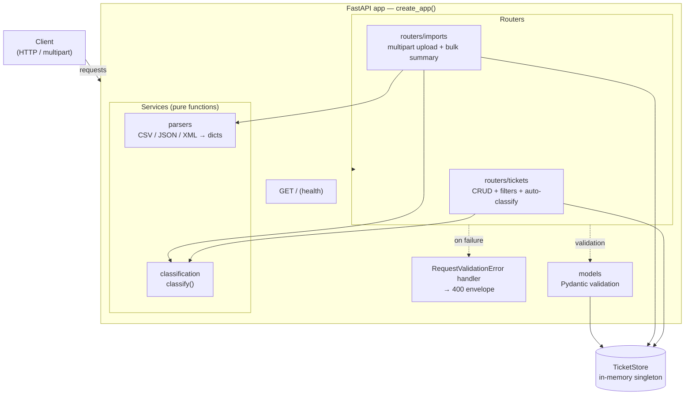
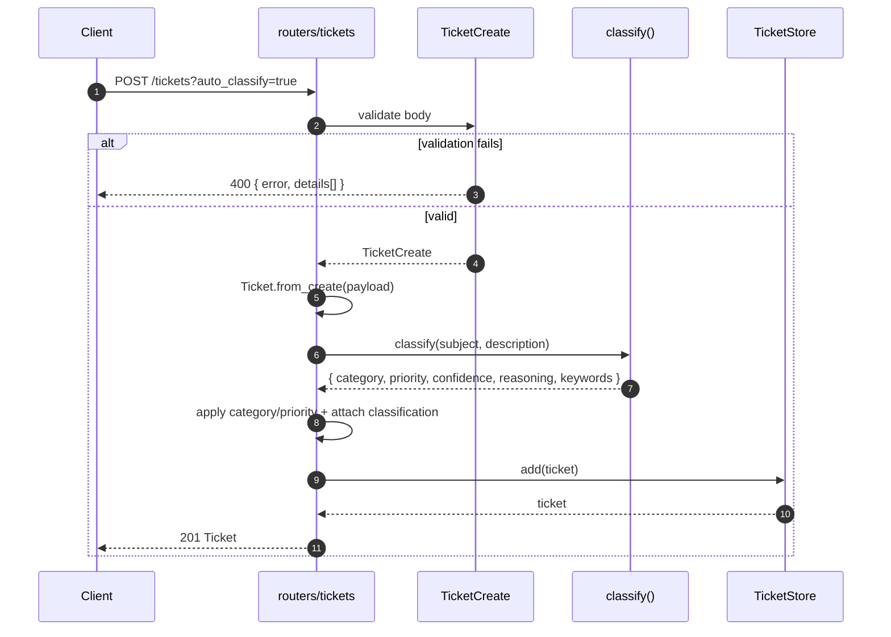
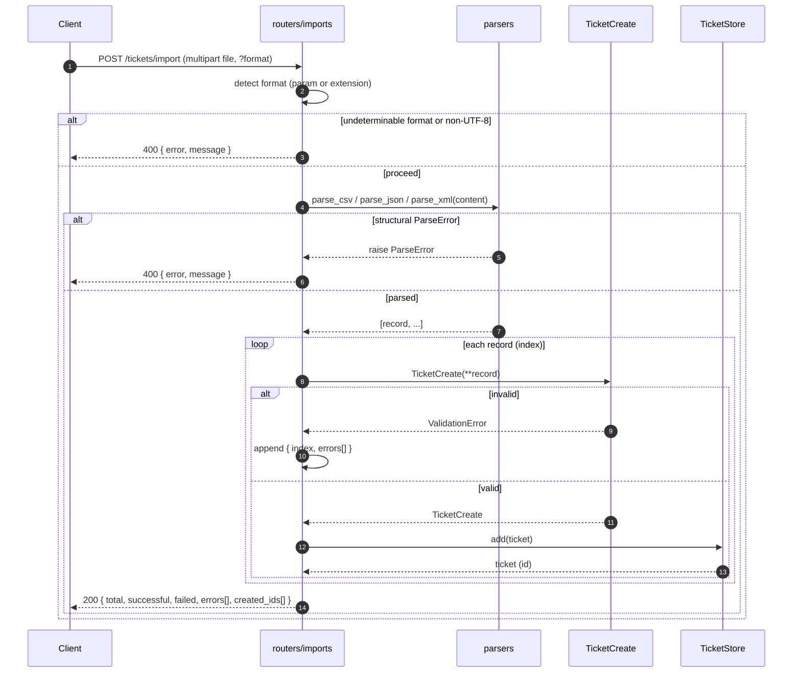

# Customer Support Ticket API — Architecture

> **Author**: Simon Darienko
>
> Audience: technical leads. This document describes the structure, data flows,
> and design rationale of the Customer Support Ticket API.

**Stack:** Python + FastAPI · in-memory store · deterministic keyword classifier ·
multipart bulk import (requires `python-multipart`).
**Quality gate:** 78 tests, 95% line coverage.

---

## 1. High-level architecture

The service is a single FastAPI application assembled by an app factory. Requests
enter through two routers, which delegate business logic to pure service modules
(parsers, classification) and persist through a single in-memory store.

---

## 2. Component descriptions

**models (`src/models.py`) — Pydantic v2 validation.**
Defines the request/response contracts: `TicketCreate` (create payload),
`TicketUpdate` (all-optional partial for PUT semantics), `Ticket` (stored/served
shape with server-managed `id`, `created_at`, `updated_at`, `resolved_at`, and an
optional `classification` dict), and the nested `Metadata`. Field-level validators
enforce bounds (subject 1–200 chars, description 10–2000 chars), non-empty
`customer_id`/`customer_name`, RFC-compliant emails via `EmailStr`, and membership
in the shared enum sets from `constants.py`. Validators raise `ValueError` with
per-field messages so the custom handler in `main.py` can surface clean details.
`Ticket.from_create()` builds a stored ticket and stamps both timestamps to the
same UTC instant.

**storage (`src/storage.py`) — in-memory singleton `TicketStore`.**
A thin wrapper over an insertion-ordered `dict` keyed by ticket id, exposing
`add`, `get`, `list`, `update`, `delete`, and `clear`. A module-level singleton
`store` is imported by both routers, so every request in the process operates on
the same data. `list()` preserves insertion order; `clear()` exists primarily to
reset state between tests. State is lost on restart by design.

**routers/tickets (`src/routers/tickets.py`) — CRUD + filters + auto-classify.**
Mounts under `/tickets`. `POST ""` creates a ticket (201) and, when
`auto_classify=true`, runs `classify()` and applies the resulting category and
priority while persisting the full classification result. `GET ""` lists tickets
with optional AND-combined filters (`category`, `priority`, `status`,
`assigned_to`, `customer_id`, `tag`). `GET /{id}` and `DELETE /{id}` return 404
when absent (204 on delete). `PUT /{id}` applies only the fields actually sent
(`exclude_unset`), bumps `updated_at`, and sets `resolved_at` on the first
transition into `resolved`/`closed`. `POST /{id}/auto-classify` re-classifies a
stored ticket.

**routers/imports (`src/routers/imports.py`) — multipart upload + bulk summary.**
Mounts `POST /tickets/import`, accepting a multipart `UploadFile`. Format is taken
from the `format` query param or inferred from the filename extension; an
undeterminable format, non-UTF-8 bytes, or a `ParseError` each return a 400 with an
`{"error","message"}` body. Records are validated **independently** against
`TicketCreate`: invalid ones are collected into `errors` (with index and messages)
while valid ones are stored. Optional `auto_classify=true` classifies each created
ticket. Always returns 200 with a summary — `total`, `successful`, `failed`,
`errors`, `created_ids`.

**parsers (`src/parsers.py`) — CSV/JSON/XML → normalized dicts, `ParseError`.**
Pure parsing utilities with no HTTP/FastAPI coupling. `parse_csv`, `parse_json`,
and `parse_xml` each take raw string content and return a list of dicts shaped for
`TicketCreate(**record)`. Empty/blank optional fields are stripped so model
defaults apply; CSV `tags` are `;`-separated, JSON expects a top-level array, XML
expects `<tickets><ticket>…`. Structural problems (missing CSV columns, invalid
JSON, non-array JSON, unparseable XML) raise `ParseError` with a human-readable
message; per-record *value* validation is deferred to the model layer.

**classification (`src/classification.py`) — keyword-based `classify()`.**
A pure, deterministic, stdlib-only heuristic. It lower-cases `subject + description`
and substring-matches keyword lists. The category with the most distinct keyword
matches wins (ties broken by list order; `other` if none match). Priority is chosen
by strict tier precedence — `urgent` > `high` > `low`, defaulting to `medium`.
Confidence starts at 0.5 for a category hit, +0.15 per additional keyword and +0.05
when priority agrees, capped at 0.95; the `other` fallback scores 0.10–0.15. Returns
`category`, `priority`, `confidence`, `reasoning`, and matched `keywords`.

**main (`src/main.py`) — `create_app()` factory + 400 validation handler.**
`create_app()` builds the `FastAPI` instance, includes both routers, exposes a
`GET /` health/identity endpoint, and registers a `RequestValidationError` handler
that overrides FastAPI's default 422 with a **400** carrying a clean, field-oriented
envelope. The factory pattern lets tests construct isolated app instances. A
module-level `app = create_app()` is the ASGI entrypoint.

---

## 3. Data flow diagrams

### (a) Create ticket with auto-classification

### (b) Bulk import (parse → per-record validate → store → summary)

---

## 4. Design decisions & trade-offs

- **In-memory storage (no database).** `TicketStore` is a process-local dict
  behind a small interface. This keeps the exercise dependency-free, makes tests
  fast and hermetic (`clear()` between cases), and isolates persistence behind a
  swappable seam. The trade-off is no durability, no cross-process sharing, and no
  concurrency guarantees — acceptable here, replaceable in production without
  touching routers or models.

- **Keyword-based classification vs. an ML model.** `classify()` is deterministic,
  transparent, and instant, with zero training data, model hosting, or inference
  latency, and it returns human-readable `reasoning`. The cost is limited
  linguistic coverage (no synonyms, negation, or context) and hand-tuned keyword
  lists. Because it lives behind a single function boundary, it can later be
  swapped for an ML/LLM classifier with the same signature.

- **Per-record error collection (partial success) vs. all-or-nothing import.**
  Bulk import validates each record independently, stores the valid ones, and
  reports failures by index in `errors`, returning 200 with a summary. This is
  friendlier for large, messy real-world files — one bad row does not discard the
  batch. The trade-off is that there is no transactional rollback; callers must
  inspect the summary to reconcile what was and was not created.

- **App-factory pattern.** `create_app()` builds a fresh, fully wired application
  on demand, so tests get isolated instances and configuration stays centralized.
  The trade-off is a small amount of indirection versus a module-level app object
  (which is still provided as `app` for the ASGI server).

- **Custom validation-error envelope.** A `RequestValidationError` handler replaces
  FastAPI's default 422 with a **400** and a consistent
  `{"error":"Validation failed","details":[{field,message}]}` shape, stripping
  Pydantic's `"Value error, "` prefix. This gives API consumers a stable, flat,
  field-oriented contract. The trade-off is deviating from the framework default
  (422) and owning the mapping logic ourselves.

---

## 5. Security & performance considerations

- **Input validation & length bounds.** Every write path flows through Pydantic
  models: subject (1–200) and description (10–2000) are length-bounded, enum fields
  (category, priority, status, source, device_type) are constrained to the sets in
  `constants.py`, and `customer_id`/`customer_name` must be non-empty. This bounds
  payload sizes and rejects malformed input at the edge.

- **Email validation.** `customer_email` uses Pydantic `EmailStr`, so structurally
  invalid addresses are rejected during validation rather than stored.

- **PII handling.** `customer_email` and `customer_name` are sensitive personal
  data. They must never be written to plaintext logs, error messages, or traces;
  redact or omit them in any logging that is added later, and treat any persistence
  layer as in-scope for data-protection controls.

- **File-size / format handling on import.** Uploads are format-gated (explicit
  `format` or extension), decoded strictly as UTF-8 (non-UTF-8 → 400), and parsed
  defensively with all structural failures funneled into `ParseError` → 400. Note
  that the current implementation reads the whole file into memory and imposes no
  explicit size cap — a production deployment should add an upload size limit
  (and ideally streaming parse) to bound memory use.

- **Statelessness.** The app holds no per-request session state; all shared state
  lives in the in-memory store. This makes request handling simple, but because
  that store is process-local, the service is **not** yet safe to scale
  horizontally without externalizing persistence.

- **Where a real system would extend this.** Production hardening would add:
  **authentication/authorization** (there is currently no auth on any endpoint),
  **rate limiting** on the public and import routes, **durable persistence**
  (replacing `TicketStore` behind its existing interface) with concurrency-safe
  updates, and **asynchronous classification** (queue/worker) so bulk imports and
  re-classification do not block request handling as classifier cost grows.
