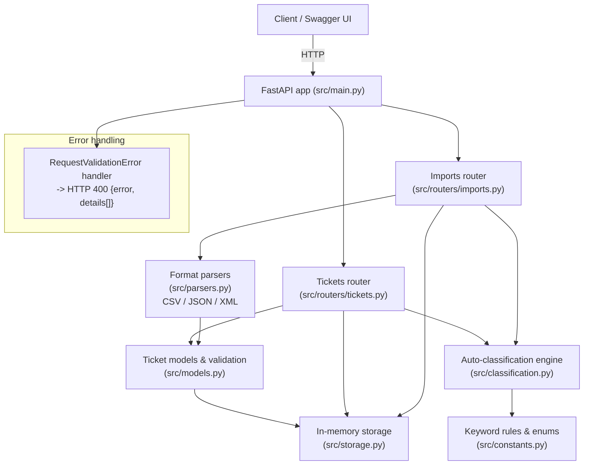

# Customer Support Ticket Management System

> **Author / Student Name**: Simon Darienko
> **Homework**: 2 — Intelligent Customer Support System
> **AI Tools Used**: Claude Code — multi-agent, multi-model workflow (Opus / Sonnet / Haiku)

A lightweight REST API for managing customer support tickets, built with **FastAPI** and an **in-memory data store** (no database required). It supports full CRUD operations, multi-format bulk import, and keyword-based automatic ticket classification.

## Overview & Features

This project implements a backend service for tracking customer support tickets through their lifecycle — from creation to resolution — with the following capabilities:

| Feature | Description |
|---|---|
| **Ticket CRUD** | Create, read, update (partial), and delete tickets via a clean REST interface. |
| **Bulk import** | Import tickets in bulk from **CSV**, **JSON**, or **XML** files via a single multipart endpoint, with **per-record error reporting** so a bad row doesn't fail the whole batch. |
| **Auto-classification** | Keyword-based engine assigns a **category**, **priority**, a **confidence score**, human-readable **reasoning**, and the matched **keywords** — either on demand or automatically at creation/import time. |
| **Filtering** | List tickets filtered by category, priority, status, assigned agent, customer, or tag. |
| **Validation** | Consistent HTTP 400 error payloads with per-field detail for malformed input. |
| **Test suite** | 78 automated tests covering the API, models, parsers, and classification logic, at 95% code coverage. |

### Domain model

| Concept | Values |
|---|---|
| **Category** | `account_access`, `technical_issue`, `billing_question`, `feature_request`, `bug_report`, `other` |
| **Priority** | `urgent`, `high`, `medium`, `low` |
| **Status** | `new`, `in_progress`, `waiting_customer`, `resolved`, `closed` |

## Architecture

The system is a single FastAPI application composed of a routing layer, a classification engine, format-specific parsers, and an in-memory storage layer. There is no external database or message broker — all state lives in process memory for the lifetime of the server.



## Installation & Setup

**Requirements:** Python 3.10+ (developed and tested on Python 3.14).

```bash
python3 -m venv .venv
source .venv/bin/activate
pip install -r requirements.txt
```

## Running the API

Start the development server with auto-reload:

```bash
uvicorn src.main:app --reload --port 8000
```

The API will be available at **http://localhost:8000**, with interactive Swagger documentation at **http://localhost:8000/docs**.

### Key endpoints

| Method | Path | Description |
|---|---|---|
| `GET` | `/` | Health check |
| `POST` | `/tickets` | Create a ticket (201). Supports `?auto_classify=true` |
| `GET` | `/tickets` | List tickets, with filtering by category/priority/status/assigned_to/customer_id/tag |
| `GET` | `/tickets/{id}` | Retrieve a single ticket |
| `PUT` | `/tickets/{id}` | Partially update a ticket (auto-sets `resolved_at` when status becomes `resolved` or `closed`) |
| `DELETE` | `/tickets/{id}` | Delete a ticket (204) |
| `POST` | `/tickets/{id}/auto-classify` | Run the classification engine against an existing ticket |
| `POST` | `/tickets/import` | Bulk import via multipart `file` field; `?format=csv\|json\|xml`, optional `?auto_classify=true` |

Validation failures return HTTP 400 with a consistent shape:

```json
{
  "error": "Validation failed",
  "details": [
    { "field": "priority", "message": "..." }
  ]
}
```

Sample import files for manual testing (valid and intentionally invalid/malformed) live under [`demo/`](demo/).

## Running Tests

```bash
.venv/bin/python -m pytest --cov=src --cov-report=term-missing
```

Current results: **78 passed, 95% coverage**.

## Project Structure

```
homework-2/
├── src/
│   ├── main.py                 # App factory, router wiring, validation error handler
│   ├── constants.py            # Enums and classification keyword rules
│   ├── models.py                # Ticket Pydantic models & validation
│   ├── storage.py               # In-memory ticket store
│   ├── parsers.py               # CSV / JSON / XML import parsers
│   ├── classification.py       # Keyword-based auto-classification engine
│   └── routers/
│       ├── tickets.py           # Ticket CRUD + auto-classify endpoints
│       └── imports.py           # Bulk import endpoint
├── tests/
│   ├── test_ticket_api.py
│   ├── test_ticket_model.py
│   ├── test_import_csv.py
│   ├── test_import_json.py
│   ├── test_import_xml.py
│   ├── test_categorization.py
│   ├── test_integration.py
│   ├── test_performance.py
│   └── fixtures/
├── demo/                        # Sample import files: CSV (50), JSON (20), XML (30), plus invalid/malformed
├── docs/                        # Supplementary documentation & screenshots
├── requirements.txt
└── README.md
```

For deeper detail, see the companion documents in this folder:

- [HOWTORUN.md](HOWTORUN.md) — step-by-step setup and usage walkthrough
- [API_REFERENCE.md](API_REFERENCE.md) — full endpoint and schema reference
- [ARCHITECTURE.md](ARCHITECTURE.md) — design and architecture deep-dive
- [TESTING_GUIDE.md](TESTING_GUIDE.md) — test suite structure and coverage details

## Author

**Author: Simon Darienko**

**AI tools:** Claude Code — built with a multi-agent workflow using different models per task (Opus / Sonnet / Haiku).
