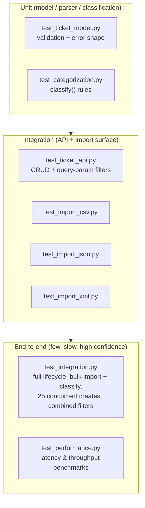

# Testing Guide — Customer Support Ticket API

> **Author**: Semen Darienko

Audience: QA engineers verifying, extending, or triaging the automated test
suite for the Customer Support Ticket API.

Framework: **pytest** driving the API through FastAPI's `TestClient`
(in-process HTTP calls, no live server required).

Current status: **78 tests passing, 95% overall coverage.**

---

## 1. Test pyramid

The suite is organized in three layers. Lower layers are numerous, fast, and
isolate a single unit; higher layers exercise more of the stack and cost more
time, so there are fewer of them.



**Why this shape:** unit tests pin down `TicketCreate` validation rules and
the `classify()` heuristic in isolation, so failures point at one function.
Integration tests exercise the real FastAPI routes (`/tickets`,
`/tickets/import`) end-to-end through `TestClient`, catching wiring and
serialization issues the unit tests can't see. The end-to-end layer strings
several operations together (create → update → resolve, import → classify,
concurrent writers, multi-filter queries) and adds non-functional checks
(latency, throughput) to guard against regressions that only show up under
realistic usage.

---

## 2. How to run tests

All commands assume the project virtualenv at `.venv/` and are run from the
`homework-2/` repository root.

**Full suite:**

```bash
.venv/bin/python -m pytest
```

**Full suite with coverage (line-by-line missing-lines report):**

```bash
.venv/bin/python -m pytest --cov=src --cov-report=term-missing
```

**A single file:**

```bash
.venv/bin/python -m pytest tests/test_integration.py
```

**A single test (`ClassName::test_name` or `file.py::test_name`):**

```bash
.venv/bin/python -m pytest tests/test_integration.py::test_concurrent_create_operations
```

Useful extra flags:

```bash
# stop at first failure, show local variables on failure
.venv/bin/python -m pytest -x -l

# verbose test names as they run
.venv/bin/python -m pytest -v

# run only tests whose name matches a keyword
.venv/bin/python -m pytest -k "filter"
```

Test isolation note: `tests/conftest.py` defines an **autouse** fixture that
calls `store.clear()` before and after every test, and a `client` fixture
returning a fresh `TestClient(app)`. You do not need to reset state manually
between tests or manage server startup — every test starts from an empty
in-memory ticket store.

---

## 3. Test suite overview

| File | What it covers |
|---|---|
| `tests/test_ticket_api.py` | Ticket CRUD (`create`, `list`, `get`, `update`, `delete`), 404 handling for missing tickets, `auto_classify` flag on create, and query-param filters (`category`, `priority`, `status`, `assigned_to`, `customer_id`, `tag`), including a combined category+priority filter. |
| `tests/test_ticket_model.py` | `TicketCreate` field validation: required fields, email format, subject/description min/max length boundaries, invalid enum values (`category`, `priority`, `status`), invalid `metadata.source` / `device_type`, and the shape of the 422/400 validation error response. |
| `tests/test_import_csv.py` | CSV import: 50-row success case, partial success with per-row error collection, malformed CSV (missing columns) rejected with 400, `tags` string parsed into a list, `metadata.*` columns folded into a nested object, and import with `auto_classify` enabled. |
| `tests/test_import_json.py` | JSON import: 20-record success case, per-record error collection on invalid records, malformed JSON rejected with 400, format auto-detected from file extension, undetectable/unknown format rejected with 400, and explicit `?format=` query overriding the extension. |
| `tests/test_import_xml.py` | XML import: 30-ticket success case, `tags`/`metadata` parsed correctly from XML structure, malformed XML rejected with 400, per-record validation errors surfaced, and an empty-XML edge case (`tests/fixtures/empty.xml`). |
| `tests/test_categorization.py` | The `classify()` function in isolation: category matched from representative subject/description text, priority tiers (urgent/high/low/medium-default), confidence bounded to `[0, 1]`, matched keywords populated, non-empty reasoning string, fallback to `other`/`medium` when nothing matches, and the `/tickets/{id}/classify` endpoint (success + 404 on missing ticket). |
| `tests/test_integration.py` | End-to-end flows: full ticket lifecycle (create → update → resolve, checking `resolved_at`), bulk import followed by auto-classification, **25 concurrent ticket creates** via `ThreadPoolExecutor`, combined category+priority filtering, and import-then-filter end-to-end. |
| `tests/test_performance.py` | Lightweight, generous-threshold benchmarks — see [section 6](#6-performance-benchmarks). |

`tests/fixtures/` holds hand-built edge-case files (`empty.xml`,
`invalid_records.xml`) used specifically by the XML import tests, separate
from the larger demo datasets described below.

---

## 4. Sample & fixture data locations

| Path | Purpose |
|---|---|
| `demo/sample_tickets.csv` | 50 valid tickets — CSV bulk-import happy path and performance benchmark. |
| `demo/sample_tickets.json` | 20 valid tickets — JSON bulk-import happy path. |
| `demo/sample_tickets.xml` | 30 valid tickets — XML bulk-import happy path. |
| `demo/sample_tickets_invalid.csv` | CSV with some invalid rows — exercises partial-success + per-row error collection. |
| `demo/sample_tickets_invalid.json` | JSON with some invalid records — exercises partial-success + per-record error collection. |
| `demo/malformed.json` | Syntactically broken JSON — exercises the 400 "malformed file" path. |
| `demo/malformed.xml` | Syntactically broken XML — exercises the 400 "malformed file" path. |
| `tests/fixtures/empty.xml` | XML file with zero ticket records — edge case for the import parser. |
| `tests/fixtures/invalid_records.xml` | XML with per-record validation failures — exercises error collection distinct from malformed/unparsable XML. |

When adding new sample data for manual or exploratory testing, prefer
dropping it in `demo/` (bulk, realistic datasets) or `tests/fixtures/`
(small, targeted edge cases) to match the existing convention.

---

## 5. Manual testing checklist

Use this against a running instance (or via `TestClient`/`curl`/Postman) to
sanity-check a build outside the automated suite — e.g. before a release, or
when validating a fix that isn't yet covered by a regression test.

**Core CRUD**
- [ ] `POST /tickets` with a valid payload returns `201` and includes
      server-generated fields (`id`, `created_at`, `updated_at`).
- [ ] `GET /tickets` returns all created tickets.
- [ ] `GET /tickets/{id}` returns `200` with the correct ticket.
- [ ] `GET /tickets/{id}` for a non-existent id returns `404`.
- [ ] `PATCH /tickets/{id}` (partial update) updates only the provided fields.
- [ ] `PATCH /tickets/{id}` with `status=resolved` sets `resolved_at`.
- [ ] `PATCH /tickets/{id}` for a non-existent id returns `404`.
- [ ] `DELETE /tickets/{id}` returns `204` and the ticket is gone afterward.
- [ ] `DELETE /tickets/{id}` for a non-existent id returns `404`.

**Filters**
- [ ] Filter by `category` returns only matching tickets.
- [ ] Filter by `priority` returns only matching tickets.
- [ ] Filter by `status` returns only matching tickets.
- [ ] Filter by `assigned_to` returns only matching tickets.
- [ ] Filter by `customer_id` returns only matching tickets.
- [ ] Filter by `tag` returns only tickets containing that tag.
- [ ] Combining two filters (e.g. `category` + `priority`) narrows results
      to the intersection, not the union.

**Auto-classification**
- [ ] `POST /tickets?auto_classify=true` populates category/priority from
      the text instead of the submitted values.
- [ ] `POST /tickets/{id}/classify` re-classifies an existing ticket and
      persists the result.
- [ ] `POST /tickets/{id}/classify` on a non-existent id returns `404`.
- [ ] A subject/description with no recognizable keywords falls back to
      `category=other`, `priority=medium`.

**Import — happy paths**
- [ ] Import `demo/sample_tickets.csv` — all 50 rows succeed.
- [ ] Import `demo/sample_tickets.json` — all 20 records succeed.
- [ ] Import `demo/sample_tickets.xml` — all 30 records succeed.
- [ ] CSV `tags` column is split into a list; CSV `metadata.*` columns are
      folded into a nested `metadata` object.
- [ ] Import with `?auto_classify=true` classifies every imported ticket.
- [ ] Format is correctly inferred from file extension when `?format=` is
      omitted; an explicit `?format=` overrides the extension.

**Import — malformed / invalid input**
- [ ] Import `demo/sample_tickets_invalid.csv` — succeeds partially, and the
      response lists per-row errors for the bad rows.
- [ ] Import `demo/sample_tickets_invalid.json` — succeeds partially, with
      per-record errors listed.
- [ ] Import `demo/malformed.csv`-equivalent (missing required columns)
      returns `400`.
- [ ] Import `demo/malformed.json` returns `400`.
- [ ] Import `demo/malformed.xml` returns `400`.
- [ ] Import a file with an undetectable/unknown format returns `400`.
- [ ] Import an XML file with zero records (`tests/fixtures/empty.xml`)
      is handled as an edge case, not a crash.

**Validation errors**
- [ ] Omitting a required field returns a `400`/`422` with a clear error.
- [ ] An invalid email format is rejected.
- [ ] `subject` below/above the allowed length is rejected; boundary
      lengths (min and max) are accepted.
- [ ] `description` below the allowed minimum length is rejected; boundary
      length is accepted.
- [ ] Invalid `category`, `priority`, or `status` enum values are rejected.
- [ ] Invalid `metadata.source` or `metadata.device_type` values are
      rejected.
- [ ] The error response body has a consistent, documented shape (field
      name + message) that a client can parse.

---

## 6. Performance benchmarks

These are smoke-level, deliberately generous thresholds meant to catch gross
regressions (e.g. an accidental O(n²) loop), not to be treated as SLAs. All
live in `tests/test_performance.py`.

| Test | Scenario | Threshold |
|---|---|---|
| `test_bulk_import_50_rows_under_threshold` | Import `demo/sample_tickets.csv` (50 rows) via `POST /tickets/import?format=csv` | < 5.0 s |
| `test_single_create_latency` | Single `POST /tickets` | < 1.0 s |
| `test_list_with_many_tickets` | `GET /tickets` after creating 200 tickets | < 2.0 s |
| `test_classify_throughput` | 1000 sequential calls to `classify()` | < 2.0 s |
| `test_filter_over_many_tickets` | `GET /tickets?category=billing_question` after creating 200 tickets (100 matching) | < 2.0 s |

If a benchmark regresses, first re-run in isolation
(`.venv/bin/python -m pytest tests/test_performance.py -v`) to rule out
machine noise before treating it as a real regression.

---

## Coverage reference

Per-module coverage from the last full run (`--cov=src --cov-report=term-missing`):

| Module | Coverage |
|---|---|
| `src/classification.py` | 100% |
| `src/routers/tickets.py` | 100% |
| `src/main.py` | 100% |
| `src/imports.py` | 97% |
| `src/parsers.py` | 94% |
| `src/models.py` | 89% |
| **Overall** | **95%** |

`models.py` and `parsers.py` carry the remaining gaps — when adding new
validation rules or a new import format, check the `--cov-report=term-missing`
output for those two files first to see which branches still need a test.
