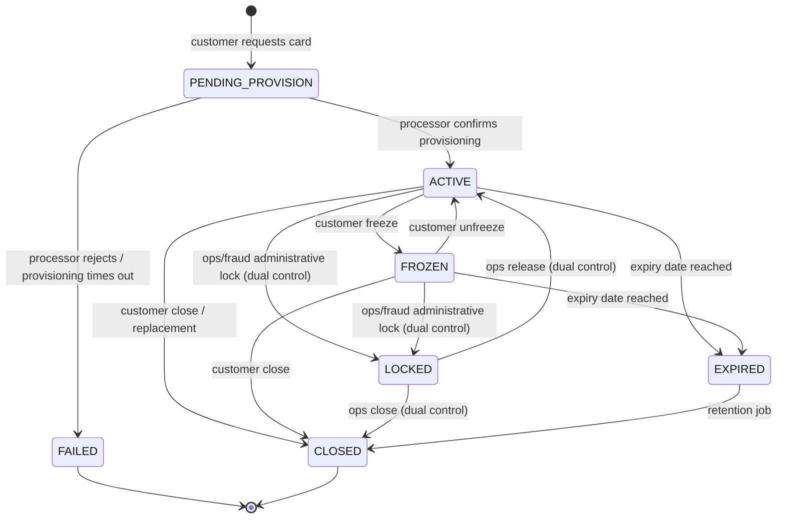

# Virtual Card Lifecycle — Feature Specification

> **Author / Student**: Simon Darienko
> **Homework**: 3 — Specification-Driven Design
> **Status**: Draft for implementation · **Spec version**: 1.0 · **Date**: 2026-08-10
> **Audience**: engineering team + AI coding agent (see [`agents.md`](./agents.md) and [`.cursor/rules/`](./.cursor/rules))

> **Instruction to the implementing agent**: Ingest this file together with `agents.md` and the rules in `.cursor/rules/`. Implement the Low-Level Tasks **in the listed order**, satisfying the High- and Mid-Level Objectives. Do not invent requirements: if something is genuinely undecided it is listed in §14 *Open Questions* — stop and ask instead of guessing.

---

## Table of contents

1. [High-Level Objective](#1-high-level-objective)
2. [Stakeholders and their observable outcomes](#2-stakeholders-and-their-observable-outcomes)
3. [Mid-Level Objectives](#3-mid-level-objectives)
4. [Domain model and state machine](#4-domain-model-and-state-machine)
5. [Non-functional and policy requirements](#5-non-functional-and-policy-requirements)
6. [Implementation notes (guardrails for builders)](#6-implementation-notes-guardrails-for-builders)
7. [Context: beginning and ending](#7-context-beginning-and-ending)
8. [Low-Level Tasks](#8-low-level-tasks)
9. [Edge cases and failure modes](#9-edge-cases-and-failure-modes)
10. [Verification strategy](#10-verification-strategy)
11. [Expected performance and SLOs](#11-expected-performance-and-slos)
12. [Traceability matrix](#12-traceability-matrix)
13. [Glossary](#13-glossary)
14. [Open questions and assumptions](#14-open-questions-and-assumptions)
15. [Explicitly out of scope](#15-explicitly-out-of-scope)

### Identifier conventions used throughout

| Prefix | Meaning | Example |
|---|---|---|
| `HLO` | High-level objective | `HLO` |
| `MLO-n` | Mid-level objective | `MLO-3` |
| `NFR-n` | Non-functional / policy requirement | `NFR-07` |
| `IN-n` | Implementation note (binding guardrail) | `IN-04` |
| `T-nn` | Low-level task | `T-14` |
| `EC-nn` | Edge case / failure mode | `EC-12` |
| `V-nn` | Verification activity | `V-05` |
| `PERF-nn` | Performance target | `PERF-02` |

Every `T-nn` states which `MLO-n` it serves; §12 closes the loop with a full traceability matrix.

---

## 1. High-Level Objective

**Enable a retail banking customer to create, control and terminate virtual payment cards entirely in-app — issuing a usable card in under a minute, and making a freeze or limit change take effect on the authorization path within two seconds — while every action leaves a tamper-evident audit trail that an ops/compliance reviewer can inspect without ever seeing a full card number.**

**Scope boundary (one sentence)**: this specification covers the *issuer-side lifecycle and control plane* of virtual cards (create · freeze/unfreeze · limits · reveal details · view transactions · replace · close) plus the authorization-time policy decision the card processor calls back into — it does **not** cover physical card manufacturing/logistics, clearing & settlement, ledger/posting, disputes/chargebacks processing, or the mobile UI itself (see §15).

---

## 2. Stakeholders and their observable outcomes

| # | Stakeholder | What they need | How we will observe success |
|---|---|---|---|
| S1 | **End-user (cardholder)** | Create a virtual card for a subscription, cap it at €20/month, freeze it instantly when suspicious, see what was charged | Card usable at a merchant < 60 s after creation; freeze reflected in a declined authorization within 2 s; transaction list matches processor within one reconciliation cycle |
| S2 | **Internal ops / compliance analyst** | Answer "who did what to this card, when, and on whose authority" without touching PAN; lock a card on a fraud signal | Any card's full history retrievable in one query, PAN never rendered; ops lock requires a second approver and is visible in the audit trail |
| S3 | **Fraud analyst** | Detect and stop abnormal issuance/spend patterns | Velocity counters expose per-customer issuance and reveal-attempt rates; administrative lock is available and irreversible by the customer |
| S4 | **Support agent (L1)** | Explain a decline to a customer | Every decline carries a stable, human-readable reason code visible to support, without exposing scheme raw responses |
| S5 | **Platform / SRE** | Keep the authorization path alive under processor degradation | Authorization decisions degrade to a documented safe default; SLO dashboards exist per §11 |
| S6 | **External auditor (annual)** | Prove controls: least privilege, segregation of duties, retention | Export of the audit trail for an arbitrary time window, with integrity verification, produced without engineering intervention |

---

## 3. Mid-Level Objectives

Each objective is phrased as an **observable change in the world**, not as an activity. Verification for each is in §10.

| ID | Objective | Observable when true |
|---|---|---|
| **MLO-1** | **Card issuance is self-service, idempotent and bounded.** A customer can request a virtual card and receive an `ACTIVE` card or a deterministic failure; retrying the same request never produces a second card. | Two identical create requests with the same `Idempotency-Key` yield one card and two identical responses; issuance beyond the per-customer cap is refused with a stable error code. |
| **MLO-2** | **Card state transitions are a closed, auditable state machine.** Freeze, unfreeze, administrative lock, replace, expire and close are the only mutations; every illegal transition is rejected uniformly. | Any transition attempt produces either a new state + one audit record, or a `409` with the current state; no code path writes `status` outside the transition function. |
| **MLO-3** | **Spending controls are authoritative at authorization time.** Per-transaction, daily, monthly and lifetime caps, plus merchant-category and country rules, decide approve/decline in the processor callback. | A card with a €20 monthly cap declines the €21st euro; the decline reason is retrievable by the customer and by support. |
| **MLO-4** | **A frozen card stops spending near-instantly.** Control-plane changes propagate to the authorization decision within a bounded, measured time. | Synthetic probe: freeze → authorize; declined within `PERF-04` (≤ 2 s p99) in 100 % of probe runs over a rolling week. |
| **MLO-5** | **Sensitive card data is never at rest in our systems and is revealed only under step-up auth.** PAN/CVV/expiry live with the processor; our service handles only tokens and a masked last-4. | Static analysis + runtime redaction tests find zero PAN-shaped strings in DB, logs, traces, error payloads and exports; reveal requires a fresh strong-auth assertion and a single-use, short-TTL token. |
| **MLO-6** | **Transaction history is complete, ordered, paginated and reconciled.** Customers and ops see the same authoritative list. | Daily reconciliation against the processor reports zero unexplained deltas; cursor pagination is stable under concurrent inserts. |
| **MLO-7** | **Every state-changing action is attributable and tamper-evident.** Actor, authority, before/after, correlation id and reason are recorded append-only. | Audit chain verification passes; an ops action without a second approver cannot be committed. |
| **MLO-8** | **Privileged access is least-privilege and segregated.** Customers touch only their own cards; ops read broadly but mutate narrowly and only under dual control. | Authorization matrix tests: every (role × action × ownership) combination has an asserted expected outcome. |
| **MLO-9** | **The system degrades predictably.** Processor outages, timeouts and duplicate callbacks have documented, tested behavior rather than emergent behavior. | Chaos/fault-injection suite in §10 passes for each failure mode listed in §9. |
| **MLO-10** | **Data retention and erasure are enforced by code, not by policy documents.** Retention clocks run; erasure requests are honoured without breaking the audit trail. | Retention job demonstrably purges PII past its window while leaving pseudonymised audit records verifiable. |

---

## 4. Domain model and state machine

### 4.1 Core entities

| Entity | Key fields (non-exhaustive) | Notes |
|---|---|---|
| `Customer` | `customer_id` (ULID, `cus_` prefix), `kyc_status`, `risk_tier`, `country` | Owned by an upstream KYC service; we consume a read-model. |
| `VirtualCard` | `card_id` (`vc_`), `customer_id`, `account_id`, `processor_card_token`, `pan_last4`, `brand`, `expiry_month`, `expiry_year`, `status`, `nickname`, `currency`, `version` (int, optimistic lock), `created_at`, `activated_at`, `closed_at`, `replaced_by_card_id` | **Never** stores PAN, CVV, or full expiry+PAN combination. `pan_last4` is display-only. |
| `SpendingControl` | `card_id`, `per_transaction_minor`, `daily_minor`, `monthly_minor`, `lifetime_minor`, `allowed_mccs[]`, `blocked_mccs[]`, `allowed_countries[]`, `effective_from`, `version` | All amounts are integer **minor units** with an explicit `currency`. |
| `SpendCounter` | `card_id`, `window` (`DAY`/`MONTH`/`LIFETIME`), `window_key`, `authorized_minor`, `settled_minor` | Authorized-but-unsettled amounts hold against limits. |
| `CardTransaction` | `transaction_id` (`txn_`), `card_id`, `processor_auth_id`, `type` (`AUTH`/`CAPTURE`/`REVERSAL`/`REFUND`), `status`, `amount_minor`, `currency`, `billing_amount_minor`, `merchant_name`, `merchant_mcc`, `merchant_country`, `decision`, `decline_reason_code`, `occurred_at`, `recorded_at` | Append-only; corrections arrive as new rows, never as updates. |
| `AuditRecord` | `audit_id`, `occurred_at`, `actor_type` (`CUSTOMER`/`OPS`/`SYSTEM`/`PROCESSOR`), `actor_id`, `on_behalf_of`, `action`, `subject_type`, `subject_id`, `before`, `after`, `reason`, `correlation_id`, `approval_id`, `prev_hash`, `hash` | Append-only, hash-chained (§6 `IN-09`). |
| `ApprovalRequest` | `approval_id`, `requested_by`, `approved_by`, `action`, `subject_id`, `justification`, `status`, `expires_at` | Maker-checker for privileged ops actions. |
| `IdempotencyRecord` | `key`, `customer_id`, `endpoint`, `request_hash`, `response_status`, `response_body`, `state` (`IN_PROGRESS`/`COMPLETED`), `expires_at` | 24 h retention (`IN-03`). |
| `OutboxEvent` | `event_id`, `aggregate_id`, `type`, `payload`, `published_at` | Transactional outbox for notifications/webhooks. |

### 4.2 Card state machine



**Transition table** — the single source of truth for `T-01`:

| From \ To | ACTIVE | FROZEN | LOCKED | EXPIRED | CLOSED | FAILED |
|---|---|---|---|---|---|---|
| `PENDING_PROVISION` | system (processor callback) | ✗ | ✗ | ✗ | ✗ | system |
| `ACTIVE` | – | customer, ops | ops⁺ | system | customer, ops⁺ | ✗ |
| `FROZEN` | customer, ops | – | ops⁺ | system | customer, ops⁺ | ✗ |
| `LOCKED` | ops⁺ | ✗ | – | system | ops⁺ | ✗ |
| `EXPIRED` | ✗ | ✗ | ✗ | – | system | ✗ |
| `CLOSED` | ✗ | ✗ | ✗ | ✗ | – | ✗ |
| `FAILED` | ✗ | ✗ | ✗ | ✗ | ✗ | – |

`⁺` = requires maker-checker approval (`NFR-11`). `✗` = illegal, must yield `409 card_invalid_state` and an audit record of the *attempt* (`NFR-09`).

**Authorization outcome by state**: `ACTIVE` → evaluate controls; `FROZEN` → decline `card_frozen`; `LOCKED` → decline `card_blocked`; `PENDING_PROVISION`/`EXPIRED`/`CLOSED`/`FAILED` → decline `card_not_active`. **A card is never "spendable by omission"** — the default branch of the decision function declines.

---

## 5. Non-functional and policy requirements

### 5.1 Security

| ID | Requirement |
|---|---|
| **NFR-01** | The service is designed to keep **PAN, CVV and track-equivalent data out of scope of our CDE**: card credentials are created and stored by the licensed card processor; we persist only `processor_card_token` and `pan_last4`. Target compliance posture: **PCI DSS v4.0 SAQ-A-EP-like** for the control plane; the reveal flow uses processor-hosted fields so credentials never transit our application servers. |
| **NFR-02** | Revealing card credentials requires (a) a valid customer session, (b) a **step-up strong authentication** assertion no older than **120 s** (PSD2 SCA — knowledge/possession/inherence, two factors), and (c) a **single-use reveal token with TTL ≤ 60 s**, bound to `card_id`, `customer_id`, device fingerprint and client IP. |
| **NFR-03** | All traffic is TLS 1.2+ (prefer 1.3). Processor callbacks are authenticated by **mTLS + HMAC-SHA256 signature over the raw body with a 5-minute timestamp window**, verified before parsing; replayed `(signature, timestamp)` pairs are rejected. |
| **NFR-04** | Secrets (processor API keys, HMAC secrets, DB credentials) come from a managed secret store, never from environment files in the repository; key rotation must be possible without redeploy. |
| **NFR-05** | Data at rest: full-disk + column-level encryption for `nickname` and any free-text customer input (potential incidental PII). Field-level encryption keys are separate from transport keys. |
| **NFR-06** | Every endpoint declares required scopes; the default is **deny**. No endpoint may rely on "the UI won't call it". |

### 5.2 Privacy and data protection

| ID | Requirement |
|---|---|
| **NFR-07** | GDPR lawful basis is *contract performance* for card data and *legal obligation* for AML/audit retention. Personal data categories are enumerated in a data map maintained at `docs/data-map.md`. |
| **NFR-08** | **Retention**: transactions and audit records are retained **10 years** (AMLD/consumer-credit alignment; **assumed** — see §14 Q3); idempotency records 24 h; reveal tokens ≤ 60 s; ops search indexes 90 days. Erasure requests pseudonymise `customer_id` in a separate mapping table and blank free-text fields, but **must not** delete or rewrite audit rows — the hash chain must still verify. |
| **NFR-09** | **Audit logging** captures every state-changing attempt (success *and* rejection) with actor, authority (scope/approval), before/after snapshots (redacted), reason and `correlation_id`. Reads of sensitive data (reveal, ops card lookup, export) are also audited. |
| **NFR-10** | Application logs are structured JSON, contain **no** PAN/CVV/reveal token/full names, and pass an automated redaction test (`T-26`). Card identifiers in logs are `card_id`, never `pan_last4` combined with customer name. |

### 5.3 Governance and controls

| ID | Requirement |
|---|---|
| **NFR-11** | **Segregation of duties / maker-checker**: administrative lock, ops-initiated close, ops-initiated release, and bulk actions require a second, distinct ops approver. Requester ≠ approver is enforced in code, not in process. |
| **NFR-12** | Ops roles: `ops.viewer` (read masked), `ops.analyst` (read + request actions), `ops.approver` (approve), `ops.admin` (role assignment, no card mutation). No single role can both request and approve. |
| **NFR-13** | All configuration that changes risk posture (limit ceilings, velocity thresholds, degradation defaults) is versioned in the repository and changes require code review; runtime feature flags may only *reduce* permissiveness. |

### 5.4 Reliability

| ID | Requirement |
|---|---|
| **NFR-14** | Availability SLO: authorization decision path **99.99 %** monthly; card management API **99.9 %**; ops console **99.5 %**. Error budget policy: burn > 50 % in a week freezes feature releases on that path. |
| **NFR-15** | **RPO = 0** for `CardTransaction`, `AuditRecord`, `VirtualCard` (synchronous replication); **RTO ≤ 15 min** for the authorization path, ≤ 60 min for management APIs. |
| **NFR-16** | The authorization decision path must not depend on any component whose failure is not covered by a documented fallback (§9 `EC-20`, `EC-21`). Cache is an accelerator, never a source of truth for `status`. |
| **NFR-17** | All external calls have explicit timeouts, bounded retries with exponential backoff + jitter, and a circuit breaker. Retries are only permitted on idempotent operations. |

### 5.5 Performance

Performance is a first-class requirement; targets, methodology and rationale are in **§11**.

---

## 6. Implementation notes (guardrails for builders)

These are **binding**. An implementation that violates one is defective even if its tests pass.

| ID | Guardrail |
|---|---|
| **IN-01** | **Money is integer minor units** (`amount_minor: int`) plus an ISO-4217 `currency` string. Floating point for money is forbidden anywhere, including tests, fixtures and log messages. Cross-currency arithmetic is forbidden — compare only within the same currency; FX-converted amounts arrive pre-converted from the processor as `billing_amount_minor` with `billing_currency`. |
| **IN-02** | **Identifiers** are ULIDs with a type prefix: `vc_`, `txn_`, `cus_`, `aud_`, `apr_`. IDs are opaque to clients, never sequential, and never encode customer data. Client-supplied IDs are never trusted as ownership proof. |
| **IN-03** | **Idempotency**: every mutating endpoint requires an `Idempotency-Key` header (UUIDv4 or ULID, ≤ 64 chars). Store `(key, customer_id, endpoint, request_hash)`. Same key + same hash → replay the stored response with `Idempotency-Replayed: true`. Same key + **different** hash → `409 idempotency_key_reuse`. Key in `IN_PROGRESS` → `409 request_in_flight`. Records expire after **24 h**. |
| **IN-04** | **Concurrency**: `VirtualCard` and `SpendingControl` carry a `version`. All mutations use optimistic locking (`UPDATE ... WHERE version = :expected`), and a lost update returns `409 concurrent_modification`. State transitions additionally take a row-level lock (`SELECT ... FOR UPDATE`) inside the transaction. Spend counters use atomic conditional increments, never read-modify-write in application code. |
| **IN-05** | **Error semantics**: RFC 9457 `application/problem+json` with `type`, `title`, `status`, `detail`, `code` (stable machine string), `correlation_id`. Error `code` values are a closed enum in `app/errors/catalog.py` and are part of the API contract — renaming one is a breaking change. `detail` must never include user input verbatim without escaping, and never includes sensitive values. |
| **IN-06** | **HTTP status discipline**: `400` malformed, `401` unauthenticated, `403` authenticated-but-forbidden **or** insufficient auth strength, `404` for objects the caller may not know exist (never `403` — it leaks existence), `409` state/idempotency/concurrency conflicts, `422` semantically invalid values (e.g. `daily < per_transaction`), `429` rate limited (with `Retry-After`), `503` degraded dependency. |
| **IN-07** | **Time** is UTC everywhere, serialized as RFC 3339 with `Z`. Business windows (daily/monthly caps) are evaluated in the **customer's account timezone**, stored explicitly on the account; the timezone used for a decision is recorded on the counter row so decisions are reproducible after a DST change. |
| **IN-08** | **PAN handling**: the string `pan`, `card_number`, `cvv`, `cvc` may not appear as a field name in any of our models, DTOs, DB columns or log keys. Display uses `pan_last4` only, rendered as `•••• 4242`. A regex-based redaction filter runs on every log record and every outbound error body as defence in depth (`T-26`). |
| **IN-09** | **Audit records are append-only and hash-chained**: `hash = SHA256(prev_hash ‖ canonical_json(record_without_hash))`. There is no `UPDATE`/`DELETE` grant on the audit table for the application role. Writing the audit record happens in the **same database transaction** as the state change — if the audit write fails, the business change is rolled back. |
| **IN-10** | **Transactional outbox**: notifications and webhooks are never sent inside the request; they are appended to `OutboxEvent` in the same transaction and dispatched by a relay with at-least-once delivery. Consumers must therefore tolerate duplicates; every event carries `event_id` and `occurred_at`. |
| **IN-11** | **Processor is a port, not a dependency**: all processor interaction goes through `CardProcessorPort` (abstract). Production adapter + deterministic in-memory fake are both maintained; the fake is the substrate for integration tests and can simulate latency, 5xx, timeouts and duplicate callbacks. |
| **IN-12** | **Authorization decisions must be pure and total**: `decide(card_snapshot, controls, counters, auth_request) -> Decision` has no I/O, no clock access (time is injected), and its `match` on card status has no permissive default branch. |
| **IN-13** | **Pagination** is cursor-based (opaque, signed cursor encoding `(occurred_at, transaction_id)`), never `OFFSET`. `limit` default 25, max 100. Sort is strictly `occurred_at DESC, transaction_id DESC` so the order is total and stable. |
| **IN-14** | **Input validation** at the edge with a schema library; unknown fields are rejected (`extra="forbid"`) so a typo in `daily_limit_minor` fails loudly instead of silently doing nothing. Amount fields are bounded: `1 ≤ amount_minor ≤ 99_999_999`. |
| **IN-15** | **No PII in URLs or query strings** (they land in access logs and browser history). Ops search takes a POST body. |
| **IN-16** | **Migrations** are additive and reversible; no destructive migration may run in the same release as the code that stops using the column (expand → migrate → contract, across releases). |
| **IN-17** | **Every decline path produces a reason code** from a closed enum, mapped to (a) a customer-facing message key and (b) an internal detail. Customer-facing text must not reveal fraud-rule internals (e.g. say "This card was declined for security reasons", not "velocity rule V3 tripped"). |
| **IN-18** | **Correlation**: every request carries or is assigned a `correlation_id` (W3C `traceparent` compatible); it flows to the processor, the outbox event, the audit record and every log line. |

---

## 7. Context: beginning and ending

### 7.1 Beginning context (what exists before work starts)

**Hypothetical but fixed** — the implementing agent must treat these as given and must not redesign them.

| Existing asset | Nature | What it gives us |
|---|---|---|
| `identity-service` | Internal HTTP service | Session validation, `customer_id`, scopes, **step-up auth assertion** endpoint (`POST /v1/step-up/verify`) returning an assertion with `authenticated_at` and factor list |
| `account-service` | Internal HTTP service | `account_id`, `currency`, `timezone`, available balance, account status |
| `kyc-service` (read-model) | Kafka topic → local table | `kyc_status`, `risk_tier`, `country` per customer |
| **Card processor** ("Vertex Issuing", sandbox) | External REST API + webhooks | Card creation/tokenization, hosted reveal (iframe/PCI-proxy), authorization callbacks, transaction feed, daily settlement file |
| `notification-service` | Internal, consumes events | Push/email delivery |
| PostgreSQL 16 cluster | Infrastructure | Primary + synchronous standby |
| Redis 7 | Infrastructure | Rate limiting, velocity counters, short-lived caches (never source of truth) |
| Existing repository | Code | `pyproject.toml`, `ruff`/`mypy`/`pytest` configured, CI pipeline running lint + tests, `docs/` folder, `README.md`. **No card domain code exists.** |
| Secret store | Infrastructure | Vault-style, with a Python client already used by other services |

**Not available at start**: any card table, any processor adapter, any audit infrastructure, any ops console backend.

### 7.2 Ending context (what exists when all tasks are done)

```
virtual-cards-service/
├── app/
│   ├── api/
│   │   ├── v1/
│   │   │   ├── cards.py                  # T-09,T-12,T-13,T-18,T-19
│   │   │   ├── controls.py               # T-14
│   │   │   ├── reveal.py                 # T-11
│   │   │   ├── transactions.py           # T-16,T-17
│   │   │   ├── ops.py                    # T-20,T-21,T-22
│   │   │   └── webhooks.py               # T-10,T-15
│   │   ├── dependencies.py               # auth, scopes, correlation id  (T-07,T-18)
│   │   └── middleware/
│   │       ├── idempotency.py            # T-04
│   │       ├── rate_limit.py             # T-25
│   │       └── correlation.py            # T-26
│   ├── domain/
│   │   ├── card.py                       # entity + invariants          (T-01)
│   │   ├── state_machine.py              # transition table             (T-01)
│   │   ├── money.py                      # Money value object           (T-02)
│   │   ├── identifiers.py                # ULID + prefixes + masking    (T-03)
│   │   ├── controls.py                   # SpendingControl invariants   (T-14)
│   │   └── authorization.py              # pure decide()                (T-15)
│   ├── services/
│   │   ├── issuance.py                   # T-09,T-10
│   │   ├── lifecycle.py                  # T-12,T-13,T-18,T-19,T-21
│   │   ├── limits.py                     # T-14
│   │   ├── reveal.py                     # T-11
│   │   ├── transactions.py               # T-16,T-17
│   │   ├── audit.py                      # T-06
│   │   ├── approvals.py                  # T-21
│   │   └── notifications.py              # T-23
│   ├── ports/
│   │   ├── card_processor.py             # abstract port                (T-08)
│   │   └── clock.py                      # injectable clock             (T-08)
│   ├── adapters/
│   │   ├── vertex/                       # production processor adapter (T-08)
│   │   └── fake_processor/               # deterministic fake           (T-08)
│   ├── infrastructure/
│   │   ├── db/models.py, repositories/, migrations/   # T-01..T-06
│   │   ├── outbox/relay.py               # T-24
│   │   └── observability/                # metrics, tracing, redaction  (T-26)
│   ├── jobs/
│   │   ├── expire_cards.py               # T-02 (calendar), T-18
│   │   ├── reconcile_transactions.py     # T-28
│   │   ├── retention_purge.py            # T-27
│   │   └── provisioning_sweeper.py       # T-10
│   └── errors/catalog.py                 # T-05
├── tests/
│   ├── unit/  integration/  contract/  security/  performance/  fixtures/   # T-29
├── docs/
│   ├── threat-model.md                   # T-30
│   ├── data-map.md                       # NFR-07
│   ├── runbooks/                         # T-30
│   ├── audit-events.md                   # T-06
│   └── slo.md                            # §11
├── agents.md                             # given
└── specification.md                      # this file
```

**Expected system state at the end**: a customer can issue a card end-to-end against the fake processor; the authorization webhook returns decisions within `PERF-01`; every mutation appears in a verifiable audit chain; the reconciliation and retention jobs run on schedule; the full test suite (unit/integration/contract/security/performance smoke) passes in CI; a compliance export can be produced for an arbitrary window.

---

## 8. Low-Level Tasks

Each task follows the template shape (prompt → files → functions → details) and adds **Serves** (traceability) and **Acceptance criteria / DoD**. Tasks are ordered so that each one only depends on earlier ones.

---

### T-01 — Card entity, persistence and state machine

**Serves**: MLO-2, MLO-7
**Prompt**: "Create the `VirtualCard` aggregate, its SQLAlchemy model + Alembic migration, and a table-driven state machine that is the *only* way `status` may change."
**Files**: `app/domain/card.py`, `app/domain/state_machine.py`, `app/infrastructure/db/models.py`, `app/infrastructure/db/migrations/0001_cards.py`, `app/infrastructure/db/repositories/cards.py`
**Functions**: `VirtualCard`, `CardStatus` (enum), `TRANSITIONS` (frozen mapping), `can_transition(from, to, actor_role) -> bool`, `apply_transition(card, to, actor, reason) -> VirtualCard`, `CardRepository.get_for_update()`
**Details**: encode §4.2 exactly, including which transitions require approval. `apply_transition` raises `IllegalTransition` with the current status. `status` column has a DB `CHECK` constraint listing valid values; `version` column defaults to 1 and is bumped by every write. No `setattr(card, "status", ...)` anywhere outside this module — enforce with a lint rule or an architecture test.
**Acceptance criteria**:
- [ ] A parametrised test enumerates **all** `(from, to)` pairs (7×7 = 49) and asserts allowed/denied against §4.2 — no pair untested.
- [ ] Attempting an illegal transition raises `IllegalTransition` and does not write to the DB.
- [ ] Architecture test fails the build if `status` is assigned outside `state_machine.py`.
- [ ] Migration is reversible (`alembic downgrade` restores the previous schema in CI).

---

### T-02 — `Money` value object and monetary invariants

**Serves**: MLO-3, IN-01
**Prompt**: "Implement an immutable `Money` value object over integer minor units with an ISO-4217 currency, and forbid float construction."
**Files**: `app/domain/money.py`, `tests/unit/test_money.py`
**Functions**: `Money(amount_minor: int, currency: str)`, `Money.add`, `Money.subtract`, `Money.is_greater_than`, `Money.format(locale)`, `MinorUnits.for_currency(code) -> int`
**Details**: constructor rejects `float`, `Decimal` with fractional minor units, negative amounts where the context forbids them, and unknown currency codes. Arithmetic between different currencies raises `CurrencyMismatch`. Handle 0-decimal (JPY) and 3-decimal (BHD) currencies via an exponent table; do not assume 2 decimals. `format()` is display-only and never used in comparisons.
**Acceptance criteria**:
- [ ] `Money(10.5, "EUR")` raises `TypeError`; `Money(1050, "EUR") + Money(100, "USD")` raises `CurrencyMismatch`.
- [ ] Property-based test (Hypothesis) asserts `add`/`subtract` associativity and absence of overflow for 1 ≤ n ≤ 99 999 999.
- [ ] Grep test: no `float(` and no `/ 100` in `app/domain` or `app/services`.

---

### T-03 — Identifiers, masking and PAN-shaped-data guards

**Serves**: MLO-5, IN-02, IN-08
**Prompt**: "Implement prefixed ULID generation, `pan_last4` masking helpers, and a reusable PAN-detection regex used by log/error redaction."
**Files**: `app/domain/identifiers.py`, `app/infrastructure/observability/redaction.py`
**Functions**: `new_id(prefix)`, `parse_id(value, expected_prefix)`, `mask_pan_last4(last4)`, `PAN_PATTERN`, `redact(text) -> str`
**Details**: `PAN_PATTERN` matches 13–19 digit sequences with optional separators and validates the **Luhn** checksum before redacting, to keep false positives low; matched values are replaced with `[REDACTED_PAN]`. `parse_id` rejects a mismatched prefix so a `txn_` id cannot be passed where a `vc_` id is expected.
**Acceptance criteria**:
- [ ] `redact("4242424242424242")` → `[REDACTED_PAN]`; `redact("1234567890123")` (fails Luhn) → unchanged.
- [ ] `parse_id("txn_01H...", expected_prefix="vc")` raises `InvalidIdentifier`.
- [ ] Fuzz test over 10 000 random Luhn-valid numbers finds zero leaks through `redact`.

---

### T-04 — Idempotency middleware and store

**Serves**: MLO-1, IN-03
**Prompt**: "Add an idempotency layer for all mutating endpoints implementing store-and-replay with request-hash conflict detection."
**Files**: `app/api/middleware/idempotency.py`, `app/infrastructure/db/models.py`, `migrations/0002_idempotency.py`
**Functions**: `IdempotencyMiddleware`, `IdempotencyStore.begin()`, `.complete()`, `.replay()`, `hash_request(method, path, body)`
**Details**: `begin()` performs an atomic `INSERT ... ON CONFLICT DO NOTHING`; a conflicting row in `IN_PROGRESS` yields `409 request_in_flight`, in `COMPLETED` with equal hash yields the stored response, with a different hash yields `409 idempotency_key_reuse`. The record is scoped by `customer_id` so one customer's key cannot collide with another's. Responses are stored with their status code and headers minus `Set-Cookie`. Expiry: 24 h, enforced by a partial index + purge job.
**Acceptance criteria**:
- [ ] Concurrent duplicate requests (2 threads, same key) produce exactly one side effect; one gets `409 request_in_flight` or the replayed response, never two cards.
- [ ] Replay returns byte-identical body and `Idempotency-Replayed: true`.
- [ ] A request without `Idempotency-Key` to a mutating endpoint returns `400 idempotency_key_required`.

---

### T-05 — Error catalog and problem+json mapper

**Serves**: MLO-9, IN-05, IN-06
**Prompt**: "Define the closed error-code catalog and an exception→`problem+json` mapper, including customer-safe messages."
**Files**: `app/errors/catalog.py`, `app/errors/handlers.py`, `docs/errors.md`
**Functions**: `ErrorCode` (enum), `AppError`, `to_problem(exc, correlation_id) -> JSONResponse`
**Details**: minimum codes: `card_not_found`, `card_invalid_state`, `card_frozen`, `card_blocked`, `card_not_active`, `limit_exceeded_per_transaction|daily|monthly|lifetime`, `limit_invalid_hierarchy`, `mcc_not_allowed`, `country_not_allowed`, `insufficient_auth_strength`, `reveal_token_expired`, `idempotency_key_reuse`, `request_in_flight`, `concurrent_modification`, `card_issuance_cap_reached`, `kyc_not_verified`, `processor_unavailable`, `approval_required`, `approval_self_not_allowed`, `rate_limited`. Each maps to an HTTP status per `IN-06` and to a message key; the mapper never echoes exception text from dependencies.
**Acceptance criteria**:
- [ ] Every `ErrorCode` has an entry in `docs/errors.md` with status, meaning and customer message key — test asserts the sets are equal.
- [ ] Raising an unexpected exception returns `500` with a generic body plus `correlation_id`, and the stack trace is logged, never returned.

---

### T-06 — Append-only, hash-chained audit log

**Serves**: MLO-7, NFR-09, IN-09
**Prompt**: "Implement the audit service writing hash-chained records in the same transaction as the business change, plus a chain verifier."
**Files**: `app/services/audit.py`, `app/infrastructure/db/models.py`, `migrations/0003_audit.py`, `docs/audit-events.md`, `app/jobs/verify_audit_chain.py`
**Functions**: `AuditService.record(action, actor, subject, before, after, reason, approval_id)`, `canonical_json()`, `verify_chain(from_ts, to_ts) -> ChainReport`
**Details**: DB role for the app has `INSERT` only on `audit_record`; a migration revokes `UPDATE`/`DELETE`. `before`/`after` are redacted snapshots (no tokens, no free text beyond nickname). The chain is per-shard-key (`subject_id`) plus a global daily anchor row, so verification of one card is O(history of that card). Document every action name in `docs/audit-events.md`.
**Acceptance criteria**:
- [ ] Tampering with any stored record makes `verify_chain` report the exact first broken link.
- [ ] A forced audit-write failure rolls back the accompanying card mutation (integration test with an injected fault).
- [ ] Attempting `UPDATE audit_record` as the app DB role raises a permission error in an integration test.

---

### T-07 — Authentication, scopes and ownership authorization

**Serves**: MLO-8, NFR-06, NFR-12
**Prompt**: "Implement request authentication against identity-service, scope checks and an ownership guard, with a declarative policy per endpoint."
**Files**: `app/api/dependencies.py`, `app/services/policy.py`, `tests/security/test_authorization_matrix.py`
**Functions**: `current_principal()`, `require_scopes(*scopes)`, `require_card_ownership()`, `require_ops_role(role)`, `Policy.check(principal, action, resource) -> Decision`
**Details**: principal types `CustomerPrincipal` and `OpsPrincipal`; ops principals never pass the ownership guard implicitly — ops access to a customer's card is a distinct action (`ops.card.read`) that is itself audited. A customer requesting another customer's card gets **`404`**, not `403` (`IN-06`).
**Acceptance criteria**:
- [ ] The authorization matrix test enumerates every (role × endpoint × ownership) combination with an explicitly asserted expected status; adding an endpoint without adding rows fails the build.
- [ ] Ops read of a card produces an audit record with `actor_type=OPS`.

---

### T-08 — `CardProcessorPort`, production adapter skeleton and deterministic fake

**Serves**: MLO-1, MLO-9, IN-11
**Prompt**: "Define the processor port and implement both the Vertex adapter (HTTP, mTLS, signed webhooks) and a deterministic fake supporting fault injection."
**Files**: `app/ports/card_processor.py`, `app/ports/clock.py`, `app/adapters/vertex/*`, `app/adapters/fake_processor/*`
**Functions**: `CardProcessorPort.create_card()`, `.freeze()`, `.unfreeze()`, `.close()`, `.create_reveal_session()`, `.fetch_transactions(since)`; `FakeProcessor.set_fault(mode)`
**Details**: all methods take an `idempotency_key` and a `correlation_id`. Timeouts: connect 1 s, read 3 s for lifecycle calls, **read 250 ms** for anything on the authorization path. Retries: max 2, only on connect errors/`502`/`503`/`504`, exponential backoff with jitter, never on `4xx`. Circuit breaker opens after 5 consecutive failures within 30 s, half-opens after 15 s. Fake supports `latency`, `timeout`, `http_500`, `duplicate_webhook`, `out_of_order_webhook`, `reject_provisioning`.
**Acceptance criteria**:
- [ ] Contract tests run the same suite against fake and (in a nightly job) the sandbox, asserting identical observable behavior for the happy path and for `409` semantics.
- [ ] A `POST` that times out and is retried does **not** create two processor cards (idempotency key is forwarded) — verified with the fake.

---

### T-09 — Create virtual card (control-plane use case)

**Serves**: MLO-1, MLO-5, MLO-7
**Prompt**: "Implement `POST /v1/cards`: validate eligibility, persist `PENDING_PROVISION`, call the processor, and return the card resource."
**Files**: `app/api/v1/cards.py`, `app/services/issuance.py`
**Functions**: `create_card_endpoint`, `IssuanceService.create_card(customer_id, request)`
**Details**: eligibility gate = `kyc_status == VERIFIED` **and** account active **and** active-card count < **5** (assumed cap, §14 Q1) **and** cards created in last 24 h < 10. Persist `PENDING_PROVISION` **before** the processor call so a timeout leaves a recoverable record. On processor success, transition to `ACTIVE` and store `processor_card_token`, `pan_last4`, `expiry_month/year`, `brand`. On processor `4xx`, transition to `FAILED` with the reason. Optional `initial_controls` applies `T-14` validation in the same transaction. Response never includes PAN/CVV.
**Acceptance criteria**:
- [ ] Response `201` contains `card_id`, `status`, `pan_last4`, `expiry_month`, `expiry_year`, `controls`; a schema test asserts the response contains **no** field matching `PAN_PATTERN` and no `cvv`.
- [ ] KYC-unverified customer → `403 kyc_not_verified`, no processor call made (asserted on the fake).
- [ ] 6th active card → `409 card_issuance_cap_reached`.
- [ ] Processor timeout leaves exactly one `PENDING_PROVISION` row and returns `202` with the card id.

---

### T-10 — Provisioning confirmation webhook + stale-provisioning sweeper

**Serves**: MLO-1, MLO-9
**Prompt**: "Handle the processor's asynchronous provisioning callback and add a sweeper that resolves cards stuck in `PENDING_PROVISION`."
**Files**: `app/api/v1/webhooks.py`, `app/jobs/provisioning_sweeper.py`, `app/services/issuance.py`
**Functions**: `provisioning_webhook`, `IssuanceService.confirm_provisioning()`, `sweep_pending_provisions()`
**Details**: verify signature per `NFR-03` **before** parsing the body. Dedupe on `processor_event_id` (unique index) — duplicates return `200` without side effects. Out-of-order events (confirmation for a card already `CLOSED`) are recorded and ignored. Sweeper runs every 60 s, queries the processor for cards `PENDING_PROVISION` older than 90 s, and resolves them to `ACTIVE` or `FAILED`; after 30 min unresolved → `FAILED` + alert.
**Acceptance criteria**:
- [ ] Duplicate webhook delivery produces one state change and one audit record (test with `FakeProcessor.set_fault("duplicate_webhook")`).
- [ ] Invalid signature → `401`, body not parsed (assert parser not invoked), attempt audited.
- [ ] Sweeper is idempotent when run concurrently (advisory lock test).

---

### T-11 — Reveal card credentials (step-up auth + single-use token)

**Serves**: MLO-5, MLO-7, NFR-02
**Prompt**: "Implement `POST /v1/cards/{card_id}/reveal-session` returning a short-lived, single-use token for the processor-hosted reveal widget."
**Files**: `app/api/v1/reveal.py`, `app/services/reveal.py`
**Functions**: `create_reveal_session`, `RevealService.issue_token()`, `RevealService.consume_token()`
**Details**: require a step-up assertion ≤ 120 s old with ≥ 2 distinct factors; otherwise `403 insufficient_auth_strength` with a `step_up_required` hint. Token: opaque, ≥ 256 bits entropy, TTL 60 s, stored **hashed** in Redis with a single-use CAS delete, bound to `card_id`+`customer_id`+device fingerprint. Our servers never receive PAN/CVV — the response contains only the token, the processor widget URL and the expiry. Every issuance and consumption is audited (`NFR-09`), including failed attempts.
**Acceptance criteria**:
- [ ] Token cannot be used twice (second use → `409 reveal_token_expired`); test asserts atomic consumption under concurrency.
- [ ] Step-up assertion 121 s old → `403 insufficient_auth_strength`.
- [ ] > 5 reveal attempts per card per hour → `429` and a fraud signal event (`T-25`).
- [ ] Response body and logs contain no PAN-shaped value (redaction test).

---

### T-12 — Freeze card

**Serves**: MLO-2, MLO-4, MLO-7
**Prompt**: "Implement `POST /v1/cards/{card_id}/freeze` with optimistic locking, processor propagation and audit."
**Files**: `app/api/v1/cards.py`, `app/services/lifecycle.py`
**Functions**: `freeze_card_endpoint`, `LifecycleService.freeze(card_id, actor, reason)`
**Details**: local state is authoritative for our decision path — write `FROZEN` locally **first**, in one transaction with the audit record and the outbox event, then propagate to the processor for defence in depth (`EC-19` covers propagation failure). Freezing an already `FROZEN` card is **idempotent success** (`200`, no new audit record beyond a `no_op` note), not an error — customers double-tap under stress. Freezing a `CLOSED` card → `409 card_invalid_state`.
**Acceptance criteria**:
- [ ] Freeze → authorize returns a decline within `PERF-04` in an integration test measuring wall-clock time.
- [ ] Freeze on `ACTIVE` returns `200` with `status=FROZEN` and `version` incremented by 1.
- [ ] Repeated freeze is a no-op success; concurrent freeze+unfreeze produces one `409 concurrent_modification`, never a lost update.

---

### T-13 — Unfreeze card

**Serves**: MLO-2, MLO-8
**Prompt**: "Implement `POST /v1/cards/{card_id}/unfreeze`, refusing to unfreeze administratively locked cards."
**Files**: `app/api/v1/cards.py`, `app/services/lifecycle.py`
**Functions**: `unfreeze_card_endpoint`, `LifecycleService.unfreeze()`
**Details**: a customer may unfreeze only `FROZEN`. `LOCKED` → `403 card_blocked` with a support-contact message key; the customer must **not** be told it was a fraud lock (`IN-17`). Unfreeze re-validates eligibility (account still active, KYC still valid) — a card frozen for 6 months must not silently return to life on a suspended account.
**Acceptance criteria**:
- [ ] Unfreeze of `LOCKED` returns `403 card_blocked`, audits the attempt, and emits a fraud signal.
- [ ] Unfreeze on a suspended account returns `409` with `account_not_active`.

---

### T-14 — Set and update spending controls

**Serves**: MLO-3, MLO-7
**Prompt**: "Implement `PUT /v1/cards/{card_id}/controls` with hierarchy validation, currency checks and versioned effective-dating."
**Files**: `app/api/v1/controls.py`, `app/domain/controls.py`, `app/services/limits.py`
**Functions**: `update_controls_endpoint`, `SpendingControl.validate()`, `LimitsService.update()`
**Details**: invariants: `per_transaction ≤ daily ≤ monthly ≤ lifetime` (any omitted level is unbounded but still ≤ the next one present); all in the card's currency; each ≥ 1 minor unit and ≤ a product ceiling (assumed **€10 000** monthly for retail, §14 Q2); `allowed_mccs` and `blocked_mccs` may not intersect; country codes are ISO-3166-1 alpha-2 and must be in the product's permitted set. **Lowering a limit below already-authorized spend is allowed** and takes effect for future authorizations only — never retroactively decline a captured transaction. Controls are versioned rows with `effective_from`; the authorization path reads the row effective at decision time.
**Acceptance criteria**:
- [ ] `daily < per_transaction` → `422 limit_invalid_hierarchy` with a `detail` naming both fields.
- [ ] Setting `monthly = 2000` when €25 is already spent this month leaves existing transactions untouched and declines the next authorization above the remaining €(20 − 25 → 0) headroom.
- [ ] Overlapping `allowed_mccs`/`blocked_mccs` → `422`.
- [ ] Update is idempotent per `Idempotency-Key` and bumps `version`.

---

### T-15 — Authorization decision endpoint (the hot path)

**Serves**: MLO-3, MLO-4, MLO-9
**Prompt**: "Implement the processor's synchronous authorization callback `POST /v1/webhooks/authorizations` with a pure decision function and atomic counter holds."
**Files**: `app/api/v1/webhooks.py`, `app/domain/authorization.py`, `app/services/limits.py`
**Functions**: `authorization_webhook`, `decide(card, controls, counters, request, now) -> Decision`, `LimitsService.hold(...)`, `.release(...)`
**Details**: order of evaluation (fail fast, cheapest first): signature → card exists → card status → currency match → per-transaction limit → MCC rules → country rules → daily → monthly → lifetime. The decision is computed by the **pure** `decide()` (`IN-12`); the endpoint only loads a snapshot, calls `decide`, and atomically applies the hold. Holds are conditional atomic increments (`UPDATE ... SET authorized = authorized + :amt WHERE authorized + :amt <= :cap`) so two concurrent authorizations cannot both pass the last euro. Reversals and expiries release holds (`T-17`). Hard budget: respond within `PERF-01`; if internal work exceeds the budget the endpoint returns the configured **degradation default = decline** (`EC-21`) rather than blocking the scheme.
**Acceptance criteria**:
- [ ] Two concurrent €15 authorizations against a €20 daily cap: exactly one approves, one declines `limit_exceeded_daily` — asserted with a 100-iteration concurrency test, zero flakes.
- [ ] `decide()` has no I/O and no `datetime.now()` — architecture test asserts the module imports nothing from `app.infrastructure`.
- [ ] Every `CardStatus` member has an explicit decision branch; adding a status without a branch fails an exhaustiveness test.
- [ ] p99 latency of the endpoint ≤ `PERF-01` in the load test (`T-29`).

---

### T-16 — List transactions (cursor pagination + filters)

**Serves**: MLO-6
**Prompt**: "Implement `GET /v1/cards/{card_id}/transactions` with stable cursor pagination and filters."
**Files**: `app/api/v1/transactions.py`, `app/services/transactions.py`, `app/infrastructure/db/repositories/transactions.py`
**Functions**: `list_transactions_endpoint`, `TransactionService.list(card_id, cursor, limit, filters)`
**Details**: filters `from`/`to` (RFC 3339), `status`, `type`, `min_amount_minor`, `merchant_country`. Cursor per `IN-13`, signed so it cannot be tampered into another card's range. Covering index on `(card_id, occurred_at DESC, transaction_id DESC)`. Response includes `next_cursor` (null at end) and never a total count (unbounded count queries are forbidden on this path).
**Acceptance criteria**:
- [ ] Inserting new transactions between page fetches never causes a previously returned row to reappear or an unseen row to be skipped (test with interleaved inserts).
- [ ] `limit=1000` → clamped to 100 (or `422`, pick one and document it); tampered cursor → `400 invalid_cursor`.
- [ ] p95 latency ≤ `PERF-05` with 100 000 rows in the table.

---

### T-17 — Transaction ingestion, enrichment and lifecycle

**Serves**: MLO-6, MLO-9
**Prompt**: "Ingest `AUTH`/`CAPTURE`/`REVERSAL`/`REFUND` events from the processor, enrich them, and keep spend counters correct."
**Files**: `app/services/transactions.py`, `app/api/v1/webhooks.py`
**Functions**: `ingest_transaction_event()`, `enrich_merchant()`, `LimitsService.settle()`, `.release_expired_holds()`
**Details**: append-only (`IN-01`, §4.1). Idempotent on `processor_event_id`. `CAPTURE` converts a hold into settled spend (partial captures supported: capture < auth releases the difference). `REVERSAL` releases the hold. `REFUND` **increases** available headroom only for the monthly/daily windows if it occurred in the same window — otherwise it is recorded but does not restore historic headroom (document this rule in the customer-facing help text). Unmatched holds expire after **7 days** and are released by a job. Merchant names are normalised (trim, collapse whitespace, title-case) for display but the raw value is preserved.
**Acceptance criteria**:
- [ ] Auth €50 → partial capture €30 leaves €20 released and `authorized_minor` consistent; a property test over random auth/capture/reversal sequences asserts counters never go negative and never exceed the sum of authorizations.
- [ ] Duplicate event delivery changes nothing (assert row count and counters).
- [ ] An out-of-order `CAPTURE` arriving before its `AUTH` is parked and resolved within one sweeper cycle, not dropped.

---

### T-18 — Close card (terminal, with pending-authorization handling)

**Serves**: MLO-2, MLO-6, MLO-7
**Prompt**: "Implement `POST /v1/cards/{card_id}/close` as an irreversible terminal transition that handles outstanding holds."
**Files**: `app/api/v1/cards.py`, `app/services/lifecycle.py`
**Functions**: `close_card_endpoint`, `LifecycleService.close(card_id, actor, reason)`
**Details**: require an explicit `confirm: true` body field **and** a fresh step-up assertion (≤ 300 s) — closing is irreversible. Outstanding authorization holds are **not** cancelled; the card stops accepting new authorizations but still accepts `CAPTURE`/`REVERSAL`/`REFUND` for 30 days (settlement window). Transaction history remains readable after close for the retention period. Emits `card.closed` on the outbox.
**Acceptance criteria**:
- [ ] Close without `confirm: true` → `422`; without step-up → `403 insufficient_auth_strength`.
- [ ] A `CAPTURE` arriving after close is recorded successfully; a new `AUTH` after close is declined `card_not_active`.
- [ ] `GET /v1/cards/{id}` after close returns `200` with `status=CLOSED` (not `404`) and history remains listable.

---

### T-19 — Replace a compromised card

**Serves**: MLO-1, MLO-2, MLO-7
**Prompt**: "Implement `POST /v1/cards/{card_id}/replace`, issuing a successor card and closing the predecessor atomically from the caller's point of view."
**Files**: `app/api/v1/cards.py`, `app/services/lifecycle.py`
**Functions**: `replace_card_endpoint`, `LifecycleService.replace(card_id, reason)`
**Details**: `reason` ∈ `{COMPROMISED, LOST_DETAILS, CUSTOMER_PREFERENCE}`. The new card copies nickname and spending controls but **not** counters (lifetime cap restarts — flag this explicitly in the response and document why). Predecessor moves to `CLOSED` with `replaced_by_card_id` set; the successor records `replaces_card_id`. If issuance of the successor fails, the predecessor is **not** closed (all-or-nothing from the customer's perspective). `reason=COMPROMISED` emits a fraud signal.
**Acceptance criteria**:
- [ ] Successor creation failure leaves the predecessor `ACTIVE` and returns `503 processor_unavailable`; test with `FakeProcessor.set_fault("reject_provisioning")`.
- [ ] Both cards are linked bidirectionally and both audit records share one `correlation_id`.

---

### T-20 — Ops read-model: card lookup and search

**Serves**: MLO-8, NFR-09, NFR-15
**Prompt**: "Implement `POST /v1/ops/cards/search` and `GET /v1/ops/cards/{card_id}` with masked output and mandatory audit of reads."
**Files**: `app/api/v1/ops.py`, `app/services/ops_search.py`
**Functions**: `ops_search_cards`, `ops_get_card`, `OpsSearchService.search(criteria)`
**Details**: searchable by `card_id`, `customer_id`, `pan_last4` + `expiry`, `processor_auth_id`. Search by `pan_last4` alone is refused (`422 search_too_broad`) — it would enumerate customers. Body-based per `IN-15`. Results are masked; no field may contain PAN. Every search is audited with the criteria (hashed for `pan_last4`) and result count. Requires `ops.viewer`.
**Acceptance criteria**:
- [ ] `pan_last4` alone → `422`; `pan_last4` + `expiry` → results, audited.
- [ ] Ops response schema test asserts no PAN-shaped field and no `processor_card_token`.
- [ ] Result set is capped at 50 with a documented "refine your search" response.

---

### T-21 — Administrative lock / release with maker-checker

**Serves**: MLO-2, MLO-7, MLO-8, NFR-11
**Prompt**: "Implement dual-control ops actions: request → approve → execute, for `LOCK`, `RELEASE` and `OPS_CLOSE`."
**Files**: `app/api/v1/ops.py`, `app/services/approvals.py`, `app/services/lifecycle.py`
**Functions**: `request_ops_action`, `approve_ops_action`, `ApprovalService.request()`, `.approve()`, `.execute()`
**Details**: requester needs `ops.analyst`, approver needs `ops.approver` and **must be a different principal** (`403 approval_self_not_allowed`). Justification is mandatory, ≥ 20 characters, stored in the audit record. Approvals expire after **4 hours** unused. Execution happens in the approval transaction; the audit record carries `approval_id`, requester and approver. `LOCK` takes effect on the authorization path within `PERF-04`.
**Acceptance criteria**:
- [ ] Self-approval is rejected and audited as an attempted control bypass.
- [ ] An expired approval cannot execute (`409 approval_expired`).
- [ ] After `LOCK`, the customer's unfreeze returns `403 card_blocked` (ties to `T-13`).

---

### T-22 — Compliance export and audit-trail query

**Serves**: MLO-7, MLO-10, S6
**Prompt**: "Implement `POST /v1/ops/audit/export` producing a signed, verifiable audit extract for a time window."
**Files**: `app/api/v1/ops.py`, `app/services/audit.py`
**Functions**: `export_audit`, `AuditService.export(from_ts, to_ts, subject_filter) -> ExportManifest`
**Details**: output is NDJSON + a manifest containing record count, first/last hash, chain-verification result and a detached signature. Exports are themselves audited and rate-limited (2/hour/principal). Windows longer than 31 days are processed asynchronously with a job id. Export must be reproducible: same window → identical bytes.
**Acceptance criteria**:
- [ ] Export of a known fixture window matches a golden file byte-for-byte.
- [ ] Manifest verification fails loudly if a record was tampered with.
- [ ] Requesting an export without `ops.approver` → `403`.

---

### T-23 — Customer notifications on lifecycle and decline events

**Serves**: MLO-4, MLO-3, S1
**Prompt**: "Consume outbox events and dispatch notifications with customer-safe copy."
**Files**: `app/services/notifications.py`, `app/infrastructure/outbox/relay.py`
**Functions**: `handle_event(event)`, `render(message_key, params)`
**Details**: notify on `card.created`, `card.frozen`, `card.unfrozen`, `card.locked` (generic security wording), `card.closed`, `card.replaced`, `limit.threshold_reached` (80 % and 100 % of monthly), `authorization.declined` (rate-limited to 3/hour/card to avoid notification storms during a card-testing attack). Copy contains `pan_last4` and nickname only — never the PAN, never the amount remaining on a fraud-locked card.
**Acceptance criteria**:
- [ ] A card-testing burst of 200 declines produces ≤ 3 notifications in the hour and one aggregated fraud signal.
- [ ] Notification payload snapshot test asserts absence of PAN-shaped values and of internal rule names.

---

### T-24 — Transactional outbox and webhook publication

**Serves**: MLO-9, IN-10
**Prompt**: "Implement the outbox table, the relay with at-least-once delivery, and consumer-side dedupe guidance."
**Files**: `app/infrastructure/outbox/*`, `migrations/0004_outbox.py`
**Functions**: `OutboxRepository.append()`, `OutboxRelay.run()`, `publish_with_retry()`
**Details**: relay polls with `SKIP LOCKED`, batches of 100, exponential backoff, dead-letter after 12 attempts with an alert. Events carry `event_id`, `type`, `occurred_at`, `aggregate_id`, `version`, `correlation_id`. Ordering is guaranteed **per aggregate**, not globally.
**Acceptance criteria**:
- [ ] Killing the relay mid-batch loses no event and duplicates at most the in-flight batch (crash test).
- [ ] Events for one card are delivered in `version` order under concurrent relays.

---

### T-25 — Rate limiting, velocity controls and fraud signals

**Serves**: MLO-9, S3, NFR-06
**Prompt**: "Implement per-principal and per-card rate limits plus velocity counters that emit fraud signals."
**Files**: `app/api/middleware/rate_limit.py`, `app/services/velocity.py`
**Functions**: `RateLimiter.check(bucket, key)`, `VelocityService.observe(event)`
**Details**: limits (**assumed**, §11 `PERF-08`): card creation 10/day/customer; reveal 5/hour/card and 15/hour/customer; lifecycle mutations 60/min/customer; ops search 120/min/principal; authorization webhook exempt (it is the processor, protected by mTLS). Sliding-window counters in Redis; **fail-closed for reveal** (Redis down → deny reveal) and **fail-open for read endpoints**. Exceeding a limit returns `429` with `Retry-After` and emits a fraud signal for the reveal and creation buckets.
**Acceptance criteria**:
- [ ] Each bucket has a test asserting the boundary (nth request passes, n+1th → `429`).
- [ ] Redis unavailable → reveal denied (`503`), transaction list still served.

---

### T-26 — Observability: metrics, tracing, redacted structured logging

**Serves**: MLO-4, MLO-5, NFR-10, NFR-14
**Prompt**: "Add structured JSON logging with a redaction filter, RED metrics, and distributed tracing carrying `correlation_id`."
**Files**: `app/infrastructure/observability/*`, `app/api/middleware/correlation.py`, `docs/slo.md`
**Functions**: `configure_logging()`, `RedactingFilter`, `record_decision_metric()`, `trace_middleware`
**Details**: metrics: `authorization_decision_latency_seconds` (histogram, labelled by outcome), `card_state_transition_total`, `freeze_propagation_seconds`, `reveal_attempts_total`, `processor_call_latency_seconds`, `outbox_lag_seconds`, `idempotency_replay_total`. Log fields are allow-listed (deny by default) so a new model field cannot leak into logs. Alerts wired to the SLOs in §11.
**Acceptance criteria**:
- [ ] A test that logs an object containing a Luhn-valid 16-digit string finds `[REDACTED_PAN]` in the emitted record.
- [ ] A log call with a non-allow-listed key raises in tests and drops the key in production.
- [ ] Every SLI in §11 has a corresponding metric and a dashboard panel referenced in `docs/slo.md`.

---

### T-27 — Retention and erasure job

**Serves**: MLO-10, NFR-08
**Prompt**: "Implement the retention job that purges expired PII and honours erasure requests without breaking the audit chain."
**Files**: `app/jobs/retention_purge.py`, `app/services/erasure.py`
**Functions**: `purge_expired()`, `handle_erasure_request(customer_id)`, `pseudonymise(customer_id)`
**Details**: purge idempotency records > 24 h, reveal tokens (TTL-driven), ops search index > 90 days, and free-text fields on cards closed > retention window. Erasure replaces `customer_id` with a pseudonym in operational tables and stores the mapping in a separately-access-controlled table; audit rows keep the pseudonym so the chain still verifies. The job runs in bounded batches with a documented maximum runtime and is safe to re-run.
**Acceptance criteria**:
- [ ] After erasure, `verify_chain` still passes for the affected subject.
- [ ] Re-running the job is a no-op (second run reports 0 rows changed).
- [ ] A test asserts that transactions inside the 10-year window are **not** purged by an erasure request (legal-hold precedence).

---

### T-28 — Daily reconciliation against the processor

**Serves**: MLO-6, MLO-9, S6
**Prompt**: "Implement a daily job reconciling our transaction store and card states against the processor's settlement file."
**Files**: `app/jobs/reconcile_transactions.py`, `docs/runbooks/reconciliation.md`
**Functions**: `reconcile(date)`, `classify_break(local, remote) -> BreakType`
**Details**: break types: `MISSING_LOCAL`, `MISSING_REMOTE`, `AMOUNT_MISMATCH`, `STATUS_MISMATCH`, `STATE_DIVERGENCE` (e.g. locally `FROZEN`, remotely active — the most dangerous). Auto-heal only `MISSING_LOCAL` by re-ingesting; everything else raises a break record for human review. `STATE_DIVERGENCE` triggers an immediate re-push of our state to the processor and a P2 alert. Output: a daily report with counts by type and a zero-break assertion.
**Acceptance criteria**:
- [ ] Seeded fixtures produce exactly one break of each type, correctly classified.
- [ ] `STATE_DIVERGENCE` with local `FROZEN` results in a processor freeze call and an alert.
- [ ] Job is idempotent per date and records its own run in the audit trail.

---

### T-29 — Test fixtures, contract tests and load harness

**Serves**: all MLOs (verification substrate)
**Prompt**: "Build the shared fixture library, the processor contract suite and a k6/Locust load scenario for the authorization path."
**Files**: `tests/fixtures/*`, `tests/contract/*`, `tests/performance/authorization_load.py`, `docs/testing.md`
**Functions**: `card_factory()`, `controls_factory()`, `auth_request_factory()`, `seed_transactions(n)`
**Details**: fixtures are deterministic (seeded), use **test PANs only** from the processor's published test range, and never contain real-looking personal data. Load scenario: ramp to `PERF-07` throughput for 10 minutes, assert p50/p99 against §11, run in CI nightly (not per-PR) with results archived.
**Acceptance criteria**:
- [ ] Fixtures generate 100 000 transactions in < 30 s for the pagination test.
- [ ] Contract suite runs unchanged against fake and sandbox.
- [ ] Load run publishes a machine-readable result and fails the nightly build if p99 regresses > 20 % versus the stored baseline.

---

### T-30 — Threat model, runbooks and compliance documentation

**Serves**: MLO-5, MLO-7, MLO-9, S6
**Prompt**: "Write the STRIDE threat model, the data map, and operational runbooks for the failure modes in §9."
**Files**: `docs/threat-model.md`, `docs/data-map.md`, `docs/runbooks/{processor-outage,freeze-not-propagating,audit-chain-break,mass-decline,reveal-abuse}.md`
**Functions**: n/a (documentation)
**Details**: the threat model enumerates assets (card token, reveal token, audit chain, ops credentials), threats per STRIDE category, existing mitigations with a reference to the `NFR`/`T` that implements them, and accepted residual risks with an owner and a review date. Each runbook has: symptom, first check, decision tree, blast-radius containment, escalation, and post-incident audit requirements.
**Acceptance criteria**:
- [ ] Every `NFR-*` in §5 appears at least once in the threat model as a mitigation.
- [ ] Every failure mode in §9 marked "runbook" has a corresponding file.
- [ ] A doc test asserts no broken internal links.

---

## 9. Edge cases and failure modes

Expected behavior is stated as **user-visible outcome** + **system/audit implication**. Cases marked *runbook* require an operational runbook from `T-30`.

| ID | Situation | Expected behavior | Audit / compliance implication |
|---|---|---|---|
| **EC-01** | Customer has zero cards | `GET /v1/cards` returns `200` with `[]` and `next_cursor: null` — never `404` | none |
| **EC-02** | Duplicate `POST /v1/cards` with same `Idempotency-Key` | One card; second call replays the stored `201` with `Idempotency-Replayed: true` | Single `card.created` audit record only |
| **EC-03** | Same `Idempotency-Key`, different body | `409 idempotency_key_reuse`; no card created | Attempt audited (possible client bug or replay attack) |
| **EC-04** | Processor times out during creation | Card stays `PENDING_PROVISION`; client gets `202` + `card_id`; sweeper resolves within 90 s | Audit records both the attempt and the resolution; no orphan processor card (idempotency key forwarded) |
| **EC-05** | Processor confirms a card we already marked `FAILED` | Late confirmation is accepted only if within 30 min; otherwise the processor card is closed by a compensating call | Audit records the compensation with reason `late_provisioning` |
| **EC-06** | Two concurrent freeze requests | One succeeds; the other returns `200` (idempotent no-op) — never `500` | One state-change audit record |
| **EC-07** | Concurrent freeze + unfreeze | One wins on `version`; the loser gets `409 concurrent_modification` and must re-read | Both attempts audited with the observed version |
| **EC-08** | Customer unfreezes a card ops has `LOCKED` | `403 card_blocked`, generic security message | Attempt audited; fraud signal emitted (`T-25`) |
| **EC-09** | Two concurrent authorizations, each fitting alone but not together | Exactly one approves; the other declines `limit_exceeded_daily` | Both decisions recorded with the counter value observed |
| **EC-10** | Authorization in a different currency than the card | Decline `currency_not_supported`; no hold placed | Recorded; repeated occurrences flagged (possible misrouting) |
| **EC-11** | Limit lowered below already-authorized spend | Accepted; applies to **future** authorizations only; existing holds/captures untouched | Audit stores before/after limits and current counter |
| **EC-12** | `daily < per_transaction` submitted | `422 limit_invalid_hierarchy` naming both fields; nothing persisted | Attempt audited |
| **EC-13** | Limit set to 0 | `422` — 0 is ambiguous ("blocked" vs "unlimited"); customers must use freeze to block | Attempt audited |
| **EC-14** | Merchant sends an amount above the account balance but within card limits | Card controls approve; balance check is the account-service's responsibility and declines separately with `insufficient_funds` | Two distinct decline reasons must never be conflated in the customer message |
| **EC-15** | Partial capture (auth €50, capture €30) | €20 hold released within one processing cycle; headroom restored | Both events stored append-only; counters reconciled next cycle |
| **EC-16** | Capture arrives before its auth (out of order) | Event parked and retried; resolved within one sweeper cycle; never dropped | Parked events are visible in ops and alert if > 15 min old |
| **EC-17** | Auth never captured | Hold auto-released after 7 days | Release is an audited system action with reason `hold_expired` |
| **EC-18** | Refund in a later month than the purchase | Recorded; does **not** restore the earlier month's headroom | Documented in customer help text to avoid disputes |
| **EC-19** | Local freeze succeeds, processor propagation fails *(runbook)* | Customer sees `FROZEN` (local is authoritative for our decisions); retry with backoff; alert if unresolved > 5 min | `STATE_DIVERGENCE` break at next reconciliation; audited as a control gap |
| **EC-20** | Processor unreachable for lifecycle ops *(runbook)* | Freeze/close still succeed locally; create returns `503 processor_unavailable` (never a fake card) | Degraded mode is logged and reported in the daily control report |
| **EC-21** | Our service too slow / dependency down on the **authorization** path *(runbook)* | Return **decline** (`decision=DECLINE`, reason `issuer_unavailable`) within the latency budget — fail closed, never approve by default | Elevated `issuer_unavailable` rate is a P1; each occurrence counted for the SLO |
| **EC-22** | Duplicate authorization webhook (same `processor_auth_id`) | Same decision replayed, hold applied **once** | Dedupe key stored; duplicates counted as a metric, not as a new decision |
| **EC-23** | Webhook with invalid signature or stale timestamp | `401`, body never parsed | Audited as a potential intrusion attempt; repeated occurrences page security |
| **EC-24** | Reveal attempted with a 3-minute-old step-up assertion | `403 insufficient_auth_strength` + `step_up_required` | Audited; repeated failures feed velocity (`T-25`) |
| **EC-25** | Reveal token replayed | `409 reveal_token_expired`; single-use consumption is atomic | Audited as a possible token-theft attempt |
| **EC-26** | 20 reveal attempts in an hour on one card | `429` after the 5th; fraud signal; optional auto-freeze per policy | Velocity breach recorded with the decision taken |
| **EC-27** | Customer requests a 6th active card | `409 card_issuance_cap_reached` with the current count | Attempt audited; repeated attempts feed velocity |
| **EC-28** | Card-testing attack (many small declines in minutes) | Progressive response: notification throttling (`T-23`), fraud signal, and auto-lock candidate for ops review | Every decline recorded; the auto-lock (if applied) still requires ops confirmation to release |
| **EC-29** | KYC status regresses to `SUSPENDED` while cards are active | New authorizations decline `kyc_not_verified`; existing captures still settle | Audited as a system-initiated restriction with the upstream event id |
| **EC-30** | Ops analyst tries to approve their own lock request | `403 approval_self_not_allowed` | Audited explicitly as an attempted segregation-of-duties bypass — reviewed monthly |
| **EC-31** | Ops searches by `pan_last4` alone | `422 search_too_broad` | Attempt audited (enumeration attempt indicator) |
| **EC-32** | Audit chain verification fails *(runbook)* | Alert P1; affected range quarantined in exports; no silent repair | Regulatory incident: documented, reported per internal policy |
| **EC-33** | Clock skew / DST boundary during a daily window | The timezone used is stored on the counter row so the decision is reproducible; windows never overlap or gap | Reconciliation compares using the stored timezone |
| **EC-34** | Stale read from a cache serving card status | Forbidden — status is always read from the primary on the decision path (`NFR-16`) | Architecture test asserts the decision path performs no cache read for `status` |
| **EC-35** | Erasure request for a customer with transactions inside the legal retention window | Erasure pseudonymises but does not delete; the customer is told which data is retained and why | Legal-hold precedence documented; audit chain still verifies |
| **EC-36** | Card expires mid-authorization | Expiry job and the decision function both read the same effective time; an authorization at `expiry + ε` declines `card_not_active` | Boundary case has a dedicated test with a frozen clock |

---

## 10. Verification strategy

### 10.1 Test categories (documented as expectations, not code)

| Category | Scope | Runs |
|---|---|---|
| **Unit** | Pure domain: state machine, `Money`, `decide()`, control validation, redaction | Every PR, < 60 s |
| **Integration** | API + DB + fake processor + Redis, transactions and rollbacks, outbox | Every PR, < 8 min |
| **Contract** | `CardProcessorPort` suite run against fake **and** sandbox | PR (fake) / nightly (sandbox) |
| **Security** | Authorization matrix, redaction, PAN-shape scanning of responses/logs/DB, dependency & secret scanning | Every PR |
| **Concurrency** | Repeated (≥ 100 iterations) races: double-spend, freeze/unfreeze, idempotency | Every PR (seeded, zero flake tolerance) |
| **Fault injection** | Each failure mode in §9 marked with a processor fault | Nightly |
| **Performance** | Load scenario per `T-29` against §11 targets | Nightly + before release |
| **Manual compliance review** | Checklist review of audit completeness, SoD, retention, data map | Before release, and quarterly |

### 10.2 Per-objective verification

| Objective | How we know it is met (`V-nn`) |
|---|---|
| MLO-1 | **V-01** Idempotency test matrix (same key/same body, same key/different body, in-flight, expired) · **V-02** issuance-cap and KYC-gate tests · **V-03** processor-timeout recovery test asserting exactly one processor card |
| MLO-2 | **V-04** exhaustive 7×7 transition test · **V-05** architecture test forbidding `status` writes outside the state machine · **V-06** every illegal transition returns `409` and is audited |
| MLO-3 | **V-07** limit hierarchy validation tests · **V-08** concurrency double-spend test (100 iterations) · **V-09** golden-file decision table covering every reason code |
| MLO-4 | **V-10** freeze→authorize wall-clock test against `PERF-04` · **V-11** synthetic production probe every 5 min with an SLO alert |
| MLO-5 | **V-12** PAN-shape scan across DB dump, log output, API responses and exports · **V-13** step-up and single-use-token tests · **V-14** annual manual PCI scope review with the data map |
| MLO-6 | **V-15** cursor-stability test with interleaved inserts · **V-16** reconciliation fixture producing one break of each type · **V-17** counter property test over random event sequences |
| MLO-7 | **V-18** chain-verification tamper test · **V-19** audit-on-rollback test · **V-20** completeness test: every mutating endpoint produces ≥ 1 audit record (enumerated from the route table, so a new endpoint without audit fails the build) |
| MLO-8 | **V-21** authorization matrix covering every (role × endpoint × ownership) · **V-22** self-approval rejection test · **V-23** `404`-not-`403` leak test |
| MLO-9 | **V-24** fault-injection suite per §9 · **V-25** degradation default test (`EC-21`) · **V-26** circuit-breaker behavior test |
| MLO-10 | **V-27** retention job idempotency and window tests · **V-28** erasure + chain-verification test · **V-29** legal-hold precedence test |

### 10.3 Review checkpoints (human gates)

| Checkpoint | When | Who | Exit criterion |
|---|---|---|---|
| **CP-1 Design review** | After `T-01`–`T-08` | Tech lead + security engineer | State machine and processor port match §4/§6; no PAN enters our boundary |
| **CP-2 Security review** | After `T-11`, `T-15` | Security + fraud | Reveal flow and decision path reviewed against the threat model; fail-closed defaults confirmed |
| **CP-3 Compliance review** | After `T-21`, `T-22` | Compliance officer | Audit completeness, SoD enforced in code, export verifiable |
| **CP-4 Performance gate** | After `T-29` | SRE | §11 targets met in the load run; dashboards and alerts live |
| **CP-5 Release readiness** | Before launch | All above | All runbooks exist; error budget policy agreed; open questions §14 answered |

### 10.4 Data fixtures

Fixtures live in `tests/fixtures/` and are the only source of test data: processor **test PANs** only; synthetic customers `cus_test_*`; a "golden card" with a known 12-month transaction history for pagination and reconciliation; a tampered-audit fixture for `V-18`; a DST-boundary fixture for `EC-33`. No production data is ever copied into any lower environment — an automated check fails the pipeline if a fixture contains a Luhn-valid non-test PAN.

---

## 11. Expected performance and SLOs

All numbers are **ASSUMED TARGETS** for this specification exercise (no production baseline exists), chosen from public card-scheme timing constraints and common FinTech UX expectations. Each has an explicit rationale. They are budgets to be validated in `T-29`/CP-4, not measurements.

| ID | Metric | Target | Why this number is reasonable |
|---|---|---|---|
| **PERF-01** | Authorization decision endpoint (issuer callback) | **p50 ≤ 25 ms, p95 ≤ 80 ms, p99 ≤ 150 ms**, hard timeout **250 ms** | Card schemes give the issuer a low-single-digit-seconds budget for the whole authorization; the processor typically reserves only a few hundred ms for the issuer's own decision hop. A 250 ms hard timeout keeps us far inside that even with one retry, and the p99 target leaves headroom for the processor's network legs. Exceeding the budget must decline (`EC-21`), never stall the scheme. |
| **PERF-02** | Card creation, our service excluding processor | p95 ≤ 250 ms | Two DB round-trips, one policy evaluation and one audit write; anything slower indicates a missing index or an N+1. |
| **PERF-03** | Card creation end-to-end incl. processor | p95 ≤ 1.5 s, p99 ≤ 3 s; **user-visible "card ready" ≤ 60 s** worst case via the async path | The HLO promises a usable card in under a minute; the async `202` path guarantees it even when the processor is slow. |
| **PERF-04** | **Freeze/lock propagation to a decline** (time-to-consistency) | **p99 ≤ 2 s** | This is the safety-critical number: a customer freezing a card believes spending stopped. Because local state is authoritative and read from the primary (`NFR-16`, `EC-34`), the only latency is transaction commit + the next authorization's read. 2 s is generous and measurable by a synthetic probe. |
| **PERF-05** | Transaction list, page of 25 | p95 ≤ 250 ms, p99 ≤ 400 ms with 100 k rows per card | Backed by the covering index in `T-16`; keeps the in-app list under the ~400 ms threshold where scrolling feels instantaneous. |
| **PERF-06** | Reveal session creation | p95 ≤ 500 ms | Includes the step-up assertion check and a processor call; the user has just completed biometrics and expects the details immediately. |
| **PERF-07** | Authorization throughput | Sustained **300 req/s**, peak **900 req/s** for 5 min, with p99 held | Sized for ~500 k active cards at retail card-usage rates with a 3× peak factor (payday/holiday). Load test ramps to peak. |
| **PERF-08** | Rate limits (protective, not performance) | Card creation 10/day/customer · reveal 5/h/card, 15/h/customer · lifecycle mutations 60/min/customer · ops search 120/min/principal · export 2/h/principal | Generous for real humans, tight enough to blunt automated abuse; the reveal limits are the tightest because reveal is the highest-value target. |
| **PERF-09** | Pagination & batch bounds | `limit` default 25, max 100 · ops search max 50 results · outbox batch 100 · retention batch 5 000 rows/tx · export async above 31 days | Bounded work per request keeps tail latency predictable and prevents a single query from monopolising the primary. |
| **PERF-10** | Outbox / notification lag | p95 ≤ 5 s, p99 ≤ 30 s from commit to dispatch | A freeze confirmation push arriving > 30 s later reads as a failure to the customer. |
| **PERF-11** | Reconciliation job | Completes within **60 min** for one day of volume; must finish before the 06:00 local ops review | Ops need the break report at the start of the working day. |
| **PERF-12** | Availability (from `NFR-14`) | Authorization path 99.99 % · management API 99.9 % · ops console 99.5 % monthly | Authorization is money-affecting and customer-visible at the point of sale; management APIs can absorb short degradations because freeze remains available. |
| **PERF-13** | Recovery (from `NFR-15`) | RPO 0 for cards/transactions/audit · RTO ≤ 15 min authorization, ≤ 60 min management | Losing an audit record or a transaction is a regulatory event, so replication is synchronous; 15 min bounds customer-visible payment failure. |

**Measurement method**: latency is measured server-side at the edge (excluding client network), reported as a rolling 28-day window, per endpoint, using the histograms from `T-26`. SLO breach → error-budget policy in `NFR-14`.

---

## 12. Traceability matrix

| Task | Serves | Verified by | Related edge cases |
|---|---|---|---|
| T-01 | MLO-2, MLO-7 | V-04, V-05, V-06 | EC-06, EC-07 |
| T-02 | MLO-3 | V-07 | EC-13 |
| T-03 | MLO-5 | V-12 | — |
| T-04 | MLO-1 | V-01 | EC-02, EC-03 |
| T-05 | MLO-9 | V-09 | EC-14 |
| T-06 | MLO-7 | V-18, V-19, V-20 | EC-32 |
| T-07 | MLO-8 | V-21, V-23 | EC-31 |
| T-08 | MLO-1, MLO-9 | V-03, V-24, V-26 | EC-04, EC-20 |
| T-09 | MLO-1, MLO-5 | V-02, V-03, V-12 | EC-04, EC-27, EC-29 |
| T-10 | MLO-1, MLO-9 | V-03, V-24 | EC-05, EC-22, EC-23 |
| T-11 | MLO-5, MLO-7 | V-13, V-12 | EC-24, EC-25, EC-26 |
| T-12 | MLO-2, MLO-4 | V-10, V-11 | EC-06, EC-07, EC-19 |
| T-13 | MLO-2, MLO-8 | V-04, V-21 | EC-08, EC-29 |
| T-14 | MLO-3 | V-07 | EC-11, EC-12, EC-13 |
| T-15 | MLO-3, MLO-4, MLO-9 | V-08, V-09, V-25 | EC-09, EC-10, EC-21, EC-22, EC-34, EC-36 |
| T-16 | MLO-6 | V-15 | EC-01 |
| T-17 | MLO-6, MLO-9 | V-17, V-16 | EC-15, EC-16, EC-17, EC-18 |
| T-18 | MLO-2, MLO-6 | V-04, V-06 | EC-36 |
| T-19 | MLO-1, MLO-2 | V-03, V-04 | EC-28 |
| T-20 | MLO-8 | V-21, V-12 | EC-31 |
| T-21 | MLO-2, MLO-7, MLO-8 | V-22, V-20 | EC-08, EC-30 |
| T-22 | MLO-7, MLO-10 | V-18 | EC-32 |
| T-23 | MLO-3, MLO-4 | V-11 | EC-28 |
| T-24 | MLO-9 | V-24 | EC-19 |
| T-25 | MLO-9 | V-24 | EC-26, EC-27, EC-28 |
| T-26 | MLO-4, MLO-5 | V-11, V-12 | EC-34 |
| T-27 | MLO-10 | V-27, V-28, V-29 | EC-35 |
| T-28 | MLO-6, MLO-9 | V-16 | EC-19, EC-33 |
| T-29 | all | V-08, PERF gate | — |
| T-30 | MLO-5, MLO-7, MLO-9 | CP-2, CP-3 | EC-19..EC-21, EC-32 |

**Coverage check**: every `MLO-1..MLO-10` is served by ≥ 2 tasks and verified by ≥ 2 `V-nn` activities; every `EC-nn` maps to at least one task. No task exists without an objective.

---

## 13. Glossary

| Term | Meaning |
|---|---|
| **PAN** | Primary Account Number — the full card number. Never stored or logged by this service. |
| **Hold / authorization** | An amount reserved at authorization time, not yet settled. Counts against limits. |
| **Capture / settlement** | The merchant claiming an authorized amount; may be partial. |
| **MCC** | Merchant Category Code (ISO 18245). |
| **SCA / step-up** | Strong Customer Authentication under PSD2 — two independent factors. |
| **Maker-checker** | Dual control: the requester of a privileged action cannot approve it. |
| **CDE** | Cardholder Data Environment — the PCI DSS scope boundary. |
| **Minor units** | The smallest currency unit (cents for EUR, yen for JPY). |
| **Break** | A discrepancy found during reconciliation. |
| **Fail closed** | On uncertainty, deny/decline rather than allow. |

---

## 14. Open questions and assumptions

Assumptions are **labelled and safe to build on**; open questions must be answered before CP-5.

| # | Item | Current assumption | Who decides |
|---|---|---|---|
| Q1 | Max active virtual cards per customer | **Assumed 5** (product-typical for retail neobanks; prevents enumeration-style abuse) | Product |
| Q2 | Product ceiling for a monthly cap | **Assumed €10 000** for retail tier; higher tiers TBD | Product + Risk |
| Q3 | Retention period for transactions/audit | **Assumed 10 years** (AML directive-aligned upper bound) | Legal/Compliance |
| Q4 | Auto-lock policy on velocity breach | **Assumed**: signal + ops review, no automatic customer-facing lock | Fraud |
| Q5 | Whether refunds restore same-window headroom | **Assumed yes for same window, no across windows** (`EC-18`) | Product |
| Q6 | Settlement acceptance window after close | **Assumed 30 days** | Payments ops |
| Q7 | Multi-currency cards | Out of scope for v1; cards are single-currency | Product |
| Q8 | PCI scope confirmation for the hosted reveal widget | Assumed SAQ-A-EP-like; must be confirmed by the QSA | Compliance/QSA |

---

## 15. Explicitly out of scope

Physical card issuance and logistics · clearing, settlement and the general ledger · disputes and chargeback processing · 3-D Secure enrolment flows · rewards/cashback · mobile or web UI implementation · the KYC decisioning engine itself · card-network certification · multi-currency wallets (Q7) · marketing consent management.

Anything in this list that appears in an implementation PR is scope creep and must be rejected at review.
