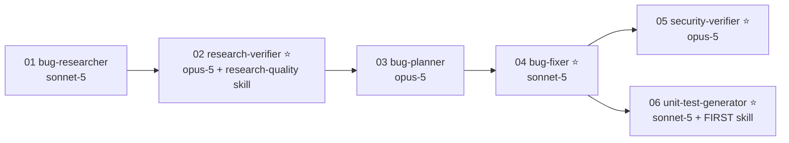

# Homework 4 — A 4-Agent Bug-Fix Pipeline

> **Author / Student Name**: Simon Darienko
> **Homework**: 4 — Multi-Agent System (4-agent pipeline)
> **AI Tools Used**: Claude Code CLI v2.1.226 — Opus 5 for the interactive build; the pipeline itself runs six headless `claude -p` agents on `claude-opus-5` and `claude-sonnet-5`

A bug-fix pipeline of AI agents that runs **end to end from one command**, on a small application that
ships with deliberately seeded defects. The agents research the bug, fact-check that research, plan the
fix, apply it, security-review the changed code, and generate unit tests for it — each stage producing a
committed artifact.

Everything in this README is the output of one real recorded run (`20260810-002935`, six stages,
23 minutes of agent time, $6.06, zero permission denials). Nothing is illustrative.

---

## Results at a glance

| | Before the pipeline | After the pipeline |
|---|---|---|
| `python3 -m src.cli stats` on a store with no completed tasks | `ZeroDivisionError` traceback | prints the JSON summary, `average_completion_days: 0.0` |
| `list --sort priority` | `high, low, medium, urgent` (alphabetical) | `urgent, high, medium, low` (by severity, deterministic tie-break) |
| `admin clear` on an unconfigured machine | succeeds with the hardcoded `hw4-admin-secret` | refused — no default token exists (`exit 3`) |
| admin token comparison | `==` (non-constant-time), error echoed the supplied token | `hmac.compare_digest`, message carries no token |
| `export "../../../../tmp/ESCAPED.txt"` | wrote the file outside the export directory | refused, nothing written (`exit 2`) |
| Test suite | 32 tests | **49 tests** (32 baseline + 17 agent-generated) |
| Hardcoded secrets in `src/` | 1 | 0 |

| Pipeline stage | Model | Status | Time | Cost | Artifact |
|---|---|---|---|---|---|
| 01 `bug-researcher` | `claude-sonnet-5` | OK | 157s | $0.5570 | [`research/codebase-research.md`](context/bugs/BUG-001/research/codebase-research.md) |
| 02 `research-verifier` ⭐ | `claude-opus-5` | OK | 300s | $1.5391 | [`research/verified-research.md`](context/bugs/BUG-001/research/verified-research.md) |
| 03 `bug-planner` | `claude-opus-5` | OK | 204s | $1.0337 | [`implementation-plan.md`](context/bugs/BUG-001/implementation-plan.md) |
| 04 `bug-fixer` ⭐ | `claude-sonnet-5` | OK | 105s | $0.7181 | [`fix-summary.md`](context/bugs/BUG-001/fix-summary.md) |
| 05 `security-verifier` ⭐ | `claude-opus-5` | OK | 369s | $1.3832 | [`security-report.md`](context/bugs/BUG-001/security-report.md) |
| 06 `unit-test-generator` ⭐ | `claude-sonnet-5` | OK | 245s | $0.8312 | [`test-report.md`](context/bugs/BUG-001/test-report.md) |

⭐ = one of the four required agents. Full run record: [`artifacts/pipeline-run.md`](artifacts/pipeline-run.md).

**Key numbers from the artifacts**: research graded **B (`RELIABLE`)** — 76 checkable claims, 73
verified, 2 drifted, 1 wrong, reference accuracy 97.36%; 5 planned changes applied with **zero
deviations** and `pytest` re-run after each; security review found **0 CRITICAL, 0 HIGH**, 1 MEDIUM,
4 LOW, 1 INFO; 17 generated tests, of which **10 fail against the pre-fix source** (independently
verified — see [`docs/screenshots/transcripts/08-tests-prefix-proof.txt`](docs/screenshots/transcripts/08-tests-prefix-proof.txt)).

---

## How it runs — one command

```bash
cd homework-4
./run-pipeline.sh            # all six agents, in order, skills loaded automatically
./run-pipeline.sh --dry-run  # free: shows stages, models, skills and cache decisions
./run-pipeline.sh --force    # ignore committed artifacts and regenerate everything
```

No per-agent invocation, no manual step between stages. For each stage the runner:

1. reads `agents/<stage>.agent.md` and parses its frontmatter (`model`, `skills`, `inputs`, `output`,
   `allowed_tools`);
2. builds the system prompt from the agent body **plus the full text of every file listed in `skills:`** —
   this is the automatic skill loading;
3. invokes `claude -p --model <model> --append-system-prompt <agent+skills> …` with only that agent's
   allowed tools;
4. fails the whole pipeline if the agent exits non-zero or does not write its declared output;
5. records the transcript, cost, duration and turn count.



Extras that make the pipeline usable rather than a one-shot script:

- **Artifact caching** — a stage whose output already exists is reported `CACHED` and skipped, so a
  reviewer can replay the pipeline for free; `--force` regenerates.
- **Partial runs** — `--from <stage>`, `--only <stage>`, `--bug <ID>`.
- **Security gate** — after stage 05 the runner greps the report for CRITICAL/HIGH findings and, if any
  exist, prints the remediation loop to run (the security agent writes reports only and never edits code).
- **Spend ceiling** — `PIPELINE_MAX_USD` (default 5) is passed to `claude --max-budget-usd` per stage.
- **Preflight** — missing `claude`, `python3`, `pytest`, agent file, skill file or bug context aborts
  before any tokens are spent.
- **Hermetic agents** — every stage runs with `--safe-mode` and `--no-session-persistence`, so an agent's
  only context is its own definition, its skills and the repository. No ambient `CLAUDE.md`, no plugins,
  no leftover session state.

See [HOWTORUN.md](HOWTORUN.md) for setup, app usage, options and troubleshooting.

---

## The agents and why each model

Explicit model per agent, declared in the frontmatter (`model:` plus a `model_rationale:` field). The
split follows one principle: **judgement runs on Opus, execution runs on Sonnet.**

| Agent | Model | Why this model |
|---|---|---|
| `bug-researcher` | `claude-sonnet-5` | Breadth-first grep-and-read over a five-module codebase. Volume matters more than depth, and everything it claims is fact-checked by the next stage — so a cheaper, faster model is the right trade. |
| `research-verifier` ⭐ | `claude-opus-5` | The pipeline's correctness gate. It must notice a line number that is off, a snippet that does not exist, or a behavioural claim that is false — and apply a multi-dimensional rubric without shortcutting the arithmetic. A miss here silently sends the planner and fixer to edit the wrong code. In the recorded run it enumerated 76 claims and caught 3 defects in the research. |
| `bug-planner` | `claude-opus-5` | Every design decision lives here: what "no data" should mean for an average, constant-time comparison, resolved-path containment, tie-break ordering. It produced 12 documented decisions, each with the rejected alternative and the reason, so the cheap executor downstream needs no judgement of its own. |
| `bug-fixer` ⭐ | `claude-sonnet-5` | Pure execution: apply the specified before/after edits, run `pytest`, record output, stop on red. No latitude, so the fast tier is the economical choice — and it finished in 105s for $0.72 with zero deviations from the plan. |
| `security-verifier` ⭐ | `claude-opus-5` | Adversarial reasoning about code that already passes its tests. Timing side channels, symlink escapes, authentication-state oracles and error-message leakage are exactly what a weaker model rationalises away. It writes no code, so the spend buys judgement only — and it found a symlink-directory escape case the fix summary never claimed to cover, plus one LOW issue *introduced* by the fix. |
| `unit-test-generator` ⭐ | `claude-sonnet-5` | Template-driven work: the FIRST skill supplies the rules, `fix-summary.md` supplies the behaviours to pin, and `pytest` supplies immediate ground truth. Fast tier keeps the file-heavy stage cheap. |

`claude-haiku-4-5` was considered for the researcher and rejected: the whole pipeline's value depends on
research that is *locatable* (exact file:line), and a weaker first stage would have shifted cost into
re-runs rather than saving it. Two tiers, deliberately chosen, beat three tiers chosen for show.

---

## The two skills

Skills are plain Markdown with frontmatter, and the runner injects them into the declaring agent's
system prompt automatically.

### [`skills/research-quality-measurement.md`](skills/research-quality-measurement.md) — Task 1.2

Defines *how research quality is measured*, so the label is computed rather than felt:

- **Claim enumeration** — reference, snippet and behavioural claims; opinions are not scored.
- **Four per-claim verdicts** — `VERIFIED` / `DRIFTED` / `WRONG` / `UNVERIFIABLE`.
- **Three dimensions** — D1 reference accuracy `(VERIFIED + 0.5×DRIFTED) / N`, D2 snippet fidelity,
  D3 root-cause coverage.
- **Five levels with hard thresholds** — **A** `VERIFIED` ≥98%, **B** `RELIABLE` ≥90%, **C**
  `USABLE_WITH_CORRECTIONS` ≥75%, **D** `WEAK` ≥50%, **E** `UNRELIABLE` below that; A/B/C are a `PASS`
  gate, D/E stop the pipeline.
- **Escalation rules** — a wrong claim about a file the fix must touch caps the grade at C; no located
  root cause caps it at E; percentages are never rounded across a threshold.
- **The exact five sections** `verified-research.md` must contain.

The verifier followed it literally: it computed `D1 = 74/76 = 97.36%`, scored D2 = 100% and
D3 = `COMPLETE`, landed on **B (`RELIABLE`)**, and showed the arithmetic.

### [`skills/unit-tests-FIRST.md`](skills/unit-tests-FIRST.md) — Task 4.2

Defines **F**ast, **I**ndependent, **R**epeatable, **S**elf-validating, **T**imely as pytest-specific
do/don't rules (no `date.today()` in assertions, `monkeypatch` for env vars, `tmp_path` for files, exact
expected values instead of truthiness, one new file per changed module, never touch the baseline suite),
plus the **mandatory self-check table** the generator must fill in with a concrete justification per
property — the word "yes" is explicitly not an acceptable answer. It also requires a **pre-fix verdict**
per test: would this test have failed before the fix, and how was that established?

The generator's filled-in table is in [`test-report.md`](context/bugs/BUG-001/test-report.md), with no
`⚠️` entries and an honest **Coverage Gaps** section (it declined to unit-test the constant-time property
of `hmac.compare_digest`, because a timing test cannot be both meaningful and Fast).

---

## The application under repair

A dependency-free Python CLI task tracker — small enough to fix in one pipeline run, real enough to have
a security surface.

```
src/models.py    Task dataclass, priority/status vocabularies, PRIORITY_RANK
src/storage.py   JSON store, listing/sorting, report export
src/auth.py      admin token check guarding destructive commands
src/stats.py     aggregate statistics
src/cli.py       add · list · complete · stats · export · admin clear
```

```bash
python3 -m src.cli add "Answer support ticket" --priority urgent
python3 -m src.cli list --sort priority
python3 -m src.cli stats
python3 -m src.cli export report.txt
```

### Seeded defects (Task 5)

Documented as a QA report in [`context/bugs/BUG-001/bug-context.md`](context/bugs/BUG-001/bug-context.md)
— **symptoms and reproductions only, no file:line hints**, so the research stage had to do real work.

| ID | Kind | Defect |
|---|---|---|
| **S1** | Bug | `average_completion_days` divided by `len(completed)` with no empty guard → `ZeroDivisionError` on any store without a completed task, which took `stats` down with it |
| **S2** | Bug | `list --sort priority` sorted by the priority *string*, producing alphabetical order instead of severity order |
| **S3a** | Security | Hardcoded fallback `DEFAULT_ADMIN_TOKEN = "hw4-admin-secret"` — destructive `admin clear` worked on any machine that had never configured a token |
| **S3b** | Security | Token compared with `==` (not constant-time), and the rejection message echoed the caller's supplied token |
| **S3c** | Security | `export_report` joined a user-supplied filename onto the export directory with no containment check → path traversal / absolute-path escape |

All five are fixed; the fixes are in [`fix-summary.md`](context/bugs/BUG-001/fix-summary.md) with
verbatim before/after code, and visible as a diff in
[`docs/screenshots/03-fixes-applied.png`](docs/screenshots/03-fixes-applied.png).

---

## What the pipeline actually found and did

**Stage 02 — research fact-checking.** 76 claims enumerated; 73 `VERIFIED`, 2 `DRIFTED`, 1 `WRONG`, and
every behavioural reproduction re-run in-session rather than taken on trust. Grade **B** (`RELIABLE`),
verdict `PASS`. The single wrong claim was a line-count statistic no fix depended on — which is exactly
the distinction the skill's escalation rules exist to draw.

**Stage 04 — the fix.** Five changes, applied in the planned order, `pytest` after each
(`32 passed` every time), **zero deviations**. `src/cli.py` and `src/models.py` were deliberately not
touched, matching the plan's declared scope.

**Stage 05 — security review.** All four security claims independently confirmed closed, with empirical
proof rather than inspection alone: for the non-echoing error message it grepped combined stdout+stderr
for both the real and the guessed token and got `0` hits; for export containment it tested `..`
traversal, an absolute path, a symlinked *file*, a symlinked *directory*, `""` and `"."` — all rejected
with nothing written, while a legitimate nested filename still worked. Remaining findings: **MEDIUM** —
the admin token is passed as a command-line argument and is therefore readable from the process table
(pre-existing; `src/cli.py` was out of the fix's scope); four **LOW**, one of which (an
"unconfigured vs wrong token" oracle in the new error message) it correctly attributed to the fix
itself; one **INFO**. Nothing CRITICAL or HIGH, so the runner's security gate passed.

**Stage 06 — test generation.** 17 tests across three new files (`tests/test_stats_fixes.py`,
`test_storage_fixes.py`, `test_auth_fixes.py`), covering regression, boundary and neighbour cases per
defect; suite run in full and one file run in isolation to demonstrate independence. Mid-stage it
noticed that the order of checks inside `verify_admin_token` had changed and corrected its own test
rather than weakening the assertion.

**Independent verification I ran myself** (not agent self-reporting):

```
generated tests vs the pre-fix source snapshot → 10 failed, 7 passed
baseline suite   vs the pre-fix source snapshot → 32 passed
current source                                 → 49 passed in 0.10s
```

The 10 failures are the genuine regression tests; the 7 passes are boundary/neighbour tests that were
expected to hold both before and after. I also re-ran every reproduction from the bug context against
the fixed CLI and confirmed each now behaves as the acceptance criteria demand, and that
`grep -rn "hw4-admin-secret" src/` returns nothing.

---

## Repository layout

```
homework-4/
├── README.md · HOWTORUN.md
├── run-pipeline.sh                  ← the single command
├── pipeline/
│   ├── stream_render.py             ← live progress rendering of the agent event stream
│   └── render_terminal.py           ← real transcripts → PNG for docs/screenshots/
├── agents/
│   ├── bug-researcher.agent.md          (support stage, sonnet-5)
│   ├── research-verifier.agent.md    ⭐  Task 1 (opus-5)
│   ├── bug-planner.agent.md             (support stage, opus-5)
│   ├── bug-fixer.agent.md            ⭐  Task 2 (sonnet-5)
│   ├── security-verifier.agent.md    ⭐  Task 3 (opus-5)
│   └── unit-test-generator.agent.md  ⭐  Task 4 (sonnet-5)
├── skills/
│   ├── research-quality-measurement.md  Task 1.2
│   └── unit-tests-FIRST.md              Task 4.2
├── context/bugs/BUG-001/
│   ├── bug-context.md
│   ├── research/codebase-research.md · research/verified-research.md
│   ├── implementation-plan.md
│   ├── fix-summary.md · security-report.md · test-report.md
├── src/                             ← the application (fixed)
├── tests/                           ← 32 baseline + 17 generated
├── artifacts/
│   ├── pipeline-run.md              ← run summary: model, status, time, cost per stage
│   └── logs/20260810-002935/        ← per-stage transcripts + raw result metadata
└── docs/screenshots/                ← evidence (see docs/screenshots/README.md)
```

---

## How AI was used to build this

The pipeline is the deliverable, but the pipeline itself was also built with Claude Code (Opus 5), and
the two roles are kept clearly separate.

**Building it** — an interactive session that started with a design interview: stack (Python, to match
homework-2), agent runtime (headless `claude -p` with artifact caching, so a reviewer can replay for
free), and how evidence would be produced. The approved design is committed at
[`docs/design-spec.md`](docs/design-spec.md). I wrote the app, seeded the defects, authored the six agent
definitions and two skills, and implemented the runner. That session is captured in
`docs/screenshots/4_1.png … 4_19.png`.

**Running it** — six autonomous agents did the graded work: research, verification, planning, fixing,
security review, test generation. Every artifact under `context/bugs/BUG-001/` was written by an agent,
not by hand.

**What I verified myself rather than trusting** — that the seeded defects actually reproduced before the
run; that the generated tests fail against the pre-fix code (the check that distinguishes real regression
tests from tests written to fit whatever the code already does); that the full suite passes; that every
bug-context reproduction now behaves correctly; and that no hardcoded token survives in `src/`.

### Challenges and how they were handled

- **"Single command" has to mean it.** Skills load automatically because the runner parses each agent's
  `skills:` frontmatter and injects the file contents into the system prompt — nothing is passed by hand
  between stages, and a stage that fails to write its declared artifact aborts the run.
- **Headless agents and tool permissions.** Non-interactive agents cannot answer a permission prompt, so
  each stage runs with an explicit per-agent `--allowed-tools` allowlist and `--permission-mode
  acceptEdits`; the recorded run has `permission_denials: []` for every stage.
- **Keeping the review honest.** The security verifier has no `Edit` tool at all — it *cannot* fix what
  it reviews, so its report cannot quietly become a diff. The same separation stops the test generator
  from touching `src/`.
- **Re-running is destructive to the demonstration.** A `--force` re-run works on already-fixed code and
  would produce a no-op fix summary, so the caching behaviour and that caveat are documented in
  HOWTORUN.md instead of being discovered by a reviewer.
- **A pipeline that only reports success is worthless.** The plan-mismatch stop, the red-suite stop, the
  missing-artifact abort and the CRITICAL/HIGH security gate all exist so a failed run looks different
  from a successful one.

---

## Task checklist

| Task | Deliverable | Status |
|---|---|---|
| 1 — Bug Research Verifier | [`agents/research-verifier.agent.md`](agents/research-verifier.agent.md) → [`verified-research.md`](context/bugs/BUG-001/research/verified-research.md) with all five required sections, PASS verdict, level **B** | ✅ |
| 1.2 — Research-quality skill | [`skills/research-quality-measurement.md`](skills/research-quality-measurement.md), auto-loaded into stage 02, arithmetic shown in the artifact | ✅ |
| 2 — Bug Fixer | [`agents/bug-fixer.agent.md`](agents/bug-fixer.agent.md) → [`fix-summary.md`](context/bugs/BUG-001/fix-summary.md): 5 changes, before/after, `pytest` after each, manual verification steps | ✅ |
| 3 — Security Verifier | [`agents/security-verifier.agent.md`](agents/security-verifier.agent.md) → [`security-report.md`](context/bugs/BUG-001/security-report.md): severity + file:line + remediation per finding, report only, no code edits | ✅ |
| 4 — Unit Test Generator | [`agents/unit-test-generator.agent.md`](agents/unit-test-generator.agent.md) → 17 tests + [`test-report.md`](context/bugs/BUG-001/test-report.md) | ✅ |
| 4.2 — FIRST skill | [`skills/unit-tests-FIRST.md`](skills/unit-tests-FIRST.md), auto-loaded into stage 06, self-check table filled in | ✅ |
| 5 — Sample mini application | [`src/`](src/) + [`tests/`](tests/): runs locally, 2 functional + 3 security defects seeded and now fixed, 49 tests green | ✅ |
| Single-command execution | [`run-pipeline.sh`](run-pipeline.sh) — six agents in order, skills auto-loaded, no manual step | ✅ |
| Explicit per-agent model | `model:` + `model_rationale:` in every `*.agent.md`, justified above | ✅ |
| Screenshots | [`docs/screenshots/`](docs/screenshots/) — pipeline run, fixes, security scan, unit tests, plus the raw transcripts they were rendered from | ✅ |
